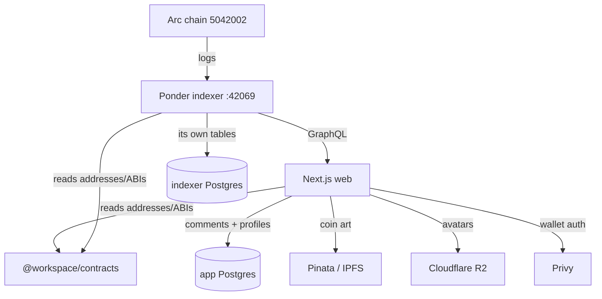

# berth.club — Architecture & Orientation

Read this first for the **map**. Read [`AGENTS.md`](../AGENTS.md) for the **rules**
(contracts/ABIs/indexer + the shared-database rails) — those are strict and cause
silent outages if ignored. This doc is the mental model; AGENTS.md is the tripwires.

## What it is

berth.club is a **non-custodial memecoin launchpad on Arc** (Circle's L1 testnet,
chain `5042002`, where the native gas token *is* USDC). Anyone connects a wallet,
launches a token (minted + pooled + LP-locked in one tx), and trades it on a bonding
curve until it "graduates". Keys-and-coins are the user's; the app never has admin
over a launched token.

## Monorepo layout

```
apps/
  web/        Next.js (App Router) frontend + API routes — the whole UI + user-facing backend
  indexer/    Ponder indexer — watches Arc for launch/trade events, serves GraphQL
packages/
  contracts/  @workspace/contracts — THE source of truth for on-chain addresses, CHAIN_ID, ABIs
  ui/         @workspace/ui — shared component primitives + cn() util
  eslint-config, typescript-config
docs/
  brainstorms/  requirements docs (ce:brainstorm output)
  plans/        implementation plans (ce:plan output)
  ARCHITECTURE.md (this file)
```

Package manager: **pnpm** workspaces. The launchpad **contracts themselves** live in a
separate repo (`Arcane-build/arc-launchpad`); this repo only *consumes* them.

## How the pieces connect



- **The web app never reads the chain for lists.** All discovery/market data comes
  from the **indexer's GraphQL** (`apps/web/lib/indexer.ts`). On-chain reads (`viem`)
  are only for live wallet/tx actions (balances, launching, trading).
- **Two separate Postgres databases.** The indexer owns one (Ponder recreates its
  tables on every reindex). The web app owns another (`app-db`) for its *own* tables —
  `coin_comments`, `user_profiles` — via **Drizzle**. Locally these are two containers;
  in prod two Railway Postgres services. They must never cross-reference. (See AGENTS.md.)
- **`@workspace/contracts` is the single source of addresses.** Never hard-code an
  address or reintroduce a `*_LAUNCH_FACTORY` env var — the web app and indexer both
  import the package so they can't point at different factories. (See AGENTS.md.)

## Key data flows

- **Launch a coin** — `components/launch-wizard.tsx` → pins art to Pinata (`/api/pin`) →
  predicts the CREATE2 address from the metadata CID → deploys via the factory (`viem`).
  The indexer picks up `TokenLaunched` and the coin appears in the Harbor.
- **Discovery / token page** — server components call `lib/indexer.ts` (GraphQL) for
  coins, trades, holders, captains, price history. `toCoin()` shapes raw rows into the
  `Coin` type (`lib/coin.ts`).
- **Coin images** — stored as `ipfs://CID`, served through a same-origin caching proxy
  `/api/img?cid=…` (never hotlinked from a gateway). `ipfsToProxy()` in `lib/chain.ts`.
- **Comments** — `/api/comments` (Privy-auth'd write, rate-limited) → `lib/comments.ts`
  (Drizzle on app-db).
- **Profiles & avatars** — `user_profiles` (Drizzle). `/api/profile` (public read,
  owner-only write). Avatars upload to **Cloudflare R2** via `/api/avatar` (`lib/r2.ts`);
  coin images stay on Pinata. Identity renders via `UserAvatar` + `avatarSrc()` which
  branches `ipfs://`→proxy, R2 `https`→direct.

## Cross-cutting conventions

- **Env split is load-bearing.** `lib/env.ts` = `NEXT_PUBLIC_*` (client-safe, **inlined
  at build time** — for a Dockerfile build they must be `ARG`s). `lib/server-env.ts` =
  secrets (`server-only`; a client import is a build error). New secret → `server-env.ts`;
  new public value → `env.ts` **and** the Dockerfile ARG + compose build.arg.
- **Auth pattern** (copy it for any authed route): `Bearer` header →
  `PrivyClient.verifyAuthToken` → `getUser` → resolve the linked wallet (lowercased).
  Routes write **only the token's wallet**, never an address from the body. See
  `app/api/comments/route.ts` and `app/api/profile/route.ts`.
- **viem only** — no ethers/web3.js anywhere.
- **Tests are assert-based `*.check.ts`** (no framework). Pure logic → runnable with
  `node --import tsx lib/x.check.ts`. DB logic → `pnpm --filter web db:check*` against a
  **throwaway** Postgres (they TRUNCATE). Non-trivial logic ships one check.
- **Graceful degradation over crashes** — a missing `DATABASE_URL`/`PINATA_JWT`/R2 config
  degrades that feature to "unavailable" rather than breaking a page. Mirror this.
- **Money/decimals on Arc**: USDC is the native gas token with a **dual-decimal** quirk —
  18-dec native balance vs the 6-dec ERC-20 at the `0x3600…` predeploy. Use `getBalance`
  (native, 18-dec) when the cost is `msg.value`; don't mix it with the ERC-20 `balanceOf`.

## Run it locally

```
docker compose up -d --build        # web :3000, indexer :42069, + two Postgres
```
`docker-compose.yml` wires everything; env comes from the repo-root `.env`
(`docker-compose` interpolates it — `NEXT_PUBLIC_*` are build args, secrets are runtime
env). See `apps/web/.env.example` for the full list (Privy, DB, Pinata, R2). Rebuild
`web` after code changes: `docker compose up -d --build web`. Prefer `next dev`
(`pnpm --filter web dev`) for fast UI iteration once env is set.

## Test & typecheck

```
pnpm --filter web typecheck                     # tsc --noEmit
node --import tsx apps/web/lib/<x>.check.ts      # pure self-checks
pnpm --filter web db:check                       # comments layer vs throwaway PG
pnpm --filter web db:check:profiles              # profiles layer vs throwaway PG
```

## Deploy

**Railway**, project `berthdotclub`. Services: `bridgedotclub-web`,
`bridgedotclub-indexer`, and two Postgres. Pushing to `main` redeploys; `railway.json`
`watchPatterns` include `packages/**` so a contracts change redeploys **both** services.

- Web migrations run at **startup** (`start` → `db:migrate`, guarded on `DATABASE_URL`).
- New env vars must be set on the Railway service. **`NEXT_PUBLIC_*` must be a build
  variable** (it's baked into the client bundle at build) — set it before deploying or
  the client reads an empty string. Use `git`, not `gh` (per-project SSH remotes).

## Gotchas (the ones that bite)

- Contract address / ABI / indexer-event drift → silent zero-index. **Read AGENTS.md.**
- Every new app table goes in `lib/db/schema.ts` **and** `drizzle.config.ts`
  `tablesFilter` — or drizzle-kit mismanages it. Never `db:push` a deployed DB.
- `NEXT_PUBLIC_*` added without the Dockerfile `ARG` → empty at runtime in prod.
- The indexer serves stale/no captains beyond its top-N queries — fetch a single entity
  directly when you need a specific wallet (see `fetchCaptain`).

## Where to look first

| Task | Start here |
|------|-----------|
| UI / a page | `apps/web/app/**`, `apps/web/components/**` |
| Reading chain data | `apps/web/lib/indexer.ts` (GraphQL), `lib/coin.ts` |
| Live wallet/tx | `apps/web/lib/chain.ts`, `lib/wagmi.ts`, `components/wallet-provider.tsx` |
| An API route | `apps/web/app/api/**` (mirror the auth pattern) |
| App DB | `apps/web/lib/db/schema.ts`, `lib/comments.ts`, `lib/profiles.ts` |
| Contracts/addresses | `packages/contracts/src/index.ts` |
| Indexing | `apps/indexer/ponder.config.ts`, `apps/indexer/src/**` |

## Working conventions

- Branch, don't commit to `main`. Confirm a change actually works before committing —
  green typecheck ≠ verified.
- Non-trivial features flow through `ce:brainstorm` → `ce:plan` → `ce:work`
  (`docs/brainstorms/` → `docs/plans/`). Match existing patterns before inventing new ones.
