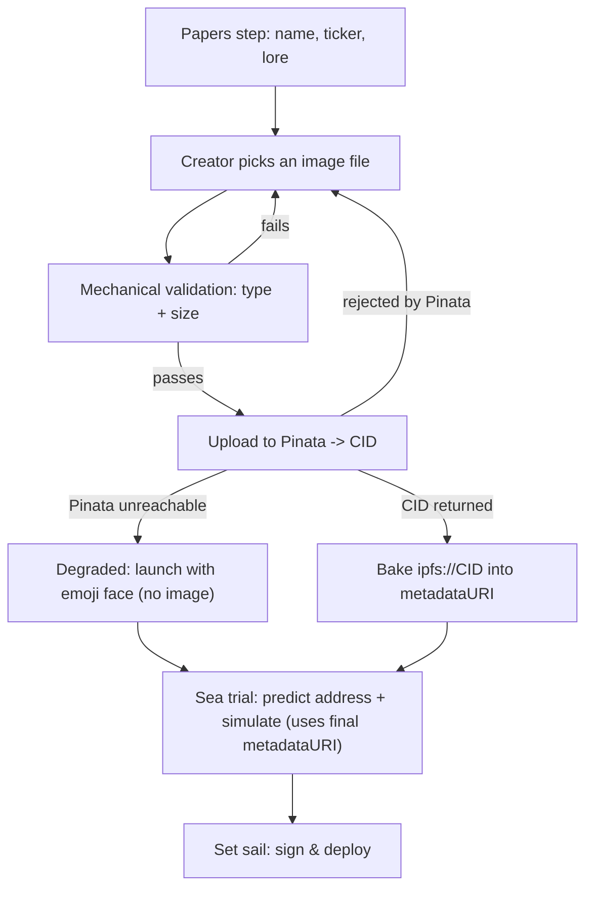

# Coin Image Upload (Pinata / IPFS)

## Problem Frame

Every coin's visual identity today is an emoji "face" picked from a fixed list,
rendered on a tinted tile (`CoinAvatar`). For a memecoin launchpad, identity is
the product — a distinct image is what makes a coin memorable and shareable, and
an emoji from a set of sixteen cannot do that. Creators want to give their coin
a real logo/art. This feature lets a creator upload an image at launch; it is
pinned to IPFS via Pinata, and its CID is carried in the coin's on-chain
`metadataURI` so the image travels with the coin.

The plumbing is already anticipated: `buildMetadataURI` embeds an `image` field
(currently a placeholder DiceBear SVG) with a code comment — *"swap it for a real
upload (ipfs://…) when that lands — nothing else here needs to change."* This
feature is that swap, plus the upload flow and the decisions around it.

## The load-bearing constraint (not negotiable)

`metadataURI` is an **ERC20 constructor argument**, so it feeds the CREATE2
initcode hash and therefore the **predicted token address** shown in the launch
wizard. Consequences the design must respect:

- The image must be uploaded and its **CID known before the address is predicted
  and before the user signs.** An upload that resolves after preview would make
  the previewed address a lie.
- `predict` and `deploy` must see a **byte-identical** `metadataURI`. The CID is
  baked into the config once, up front, and reused unchanged through signing.

## User Flow

## Requirements

**Identity & UI**
- R1. An uploaded image becomes the coin's avatar across all surfaces (harbor
  card, token page, portfolio). It replaces the emoji face for new coins.
- R2. Fallback to the generated/emoji avatar applies to any coin whose metadata
  does **not** carry an uploaded `ipfs://` image, and to any render where the
  image fails to load. Note: coins launched under the current code already carry
  a non-uploaded `image` field — a DiceBear `https://…` placeholder written by
  `buildMetadataURI`. So the render gate is the **`ipfs://` scheme specifically**;
  a present `image` field is not sufficient, or every existing coin would
  silently flip from its emoji face to a DiceBear shape (three metadata
  generations exist: `ipfs://placeholder` legacy, `data:` + DiceBear `https`
  image, and the new `data:` + `ipfs://CID`).
- R3. Every avatar surface renders the uploaded image when present (gated per R2)
  and falls back otherwise. Render-surface reality: `CoinAvatar` is currently
  **unused** — each surface (harbor card, token page, portfolio, token/user
  pages) inlines `{coin.emoji}` in a span, the `Coin` type has no `image` field,
  and `toCoin` drops `meta.image`. The work is: add `image` to the `Coin` type,
  populate it in `toCoin` (gated on `ipfs://`), and route every site through one
  avatar component. This is more than "swap one component."
- R3a. That avatar component is a **client** component: renders an `` /
  `next/image` with an `onError` that swaps to the emoji tile, distinguishes
  still-loading from failed (a slow gateway must not render as broken), fills the
  square tile with `object-fit: cover` center-anchored (identical across all
  surfaces), and carries an accessible name — `alt="{name} ({ticker}) logo"` —
  that also labels the fallback tile.
- R11. **Shared coin links render the coin's art.** Token/coin pages expose the
  uploaded image (gateway URL) plus name/ticker via **OpenGraph and Twitter-card**
  meta tags, so a link posted to social (X/Discord/etc.) shows the coin rather
  than a bare URL — delivering the "shareable" half of the value prop, not
  deferring it. A degraded-launch coin (no image) falls back to a default card.

**Launch flow**
- R4. Uploading an image is **required to launch whenever Pinata is reachable** —
  the wizard cannot reach "Set sail" without a successfully pinned image. The one
  exception is a Pinata outage (R6).
- R5. The upload completes and yields a CID **before** address prediction; the
  CID is baked into `metadataURI` and reused byte-identically through deploy
  (see load-bearing constraint).
- R6. Failure handling splits by cause. A **rejected file** (fails R7) blocks
  with a clear error and returns to the picker. A **Pinata outage**
  (unreachable/timeout) offers a **degraded emoji-only launch**: the creator may
  proceed with a generated/emoji avatar rather than being hard-blocked, so a
  third-party outage never takes all launches offline. A degraded-launch coin
  carries no `ipfs://` image and renders per R2's fallback. The degraded path is
  surfaced honestly ("Art upload is unavailable right now — launch with an emoji
  face instead?"), not as a silent downgrade.
- R7. Mechanical file validation at the trust boundary, enforced before upload:
  a **raster allowlist** (`image/png`, `image/jpeg`, `image/webp`, `image/gif`)
  that explicitly **excludes `image/svg+xml`** and any XML/HTML-bearing type — an
  SVG pinned to IPFS and served from a gateway is active content and a stored-XSS
  vector, and "image only" naively reads as "any `image/*`", which includes SVG.
  Verify by **decoded magic bytes**, not the client-supplied `Content-Type`;
  this also rejects zero-byte/corrupt files that would otherwise pin a
  permanently-broken image (the CID is immutable). Plus maximum file
  size/dimensions. This is input validation, **not** content moderation, and
  stays regardless of whether content moderation is added later.
- R10. Wizard interaction states. While the pin is in flight: show an uploading
  indicator and **block advancing to Sea trial** until the CID resolves (the
  address cannot be predicted without it — load-bearing constraint), and lock the
  file picker so the selection can't change mid-upload. On success: show the
  pinned image back in a real avatar tile — rendered from a local
  `URL.createObjectURL(file)`, **not** the gateway, since a just-pinned CID can
  be briefly unresolvable and would flash the fallback — with a **replace**
  affordance (see the back-navigation decision in Outstanding Questions).

**Storage & durability**
- R8. The image is pinned to IPFS via Pinata and referenced from the coin's
  `metadataURI` by CID, so the reference is permanent even if durability backing
  changes later.
- R9. Pinning is **best-effort** on a maintained Pinata account. Permanence is
  not guaranteed; a lapsed account or unpinned CID can 404 an image while the
  coin persists. Accepted tradeoff.

## Success Criteria
- A creator can upload an image in the launch wizard, see it as the coin's
  avatar in the preview, and after launch the same image renders on the harbor,
  token page, and portfolio.
- The predicted address shown before signing matches the deployed token address
  (i.e. the CID was baked in before prediction).
- Launching with an unreachable Pinata surfaces a clear error and does not spend
  gas or produce a coin with a broken image.
- Legacy coins with no image still render their emoji face, unbroken.
- A coin link posted to social (X/Discord) renders a card showing the coin's
  image and name/ticker (R11).
- When Pinata is unreachable, a creator can still launch with an emoji face and
  is told why — launches are never fully blocked by the upload service (R6).

## Scope Boundaries
- **No content moderation in v1** (explicit non-goal). Any image is accepted and
  rendered. Harmful/illegal content, impersonation, and stolen logos are known,
  accepted gaps until a takedown mechanism exists. Mechanical file validation
  (R7) is not moderation and is in scope.
- **No guaranteed permanence** — best-effort pinning only (R9). No Filecoin/
  redundant-pinning backing in v1.
- **No admin takedown / hide-image** surface in v1.
- **No image editing/cropping** in-app beyond what mechanical validation needs.
- Does not change the deployed contract — this rides entirely on the existing
  `metadataURI` field.

## Key Decisions
- **Image replaces the emoji face** (not coexist): one visual identity per coin,
  less UI to maintain, and it matches how memecoins present.
- **Required when Pinata is up, degraded emoji-only launch on outage** (R6):
  every coin looks intentional in the normal case, but a Pinata outage never
  blocks launching — the platform-wide availability coupling is removed rather
  than accepted.
- **Social preview shipped in v1** (R11): the "shareable" half of the value prop
  is delivered, not deferred — coin links render the art via OG/Twitter cards.
- **Best-effort Pinata pinning, CID on-chain**: cheapest path; durability can be
  upgraded later without touching the contract because only the CID is on-chain.
- **Ship without content moderation**: fastest to value; revisit post-launch.

## Dependencies / Assumptions
- **Pinata account + API credentials** are required and must exist before
  implementation. The credential-handling model (below) is a security-relevant
  planning decision.
- Assumes the deployed v1.1 factory (current live contract) — unaffected, since
  this uses the existing `metadataURI` arg. Independent of any v1.3 redeploy.

## Outstanding Questions

### Resolve Before Planning
- *(none — the product shape is decided)*

### Deferred to Planning
- [Affects R5, R10][Technical] **Predicted-address integrity.** Replacing the
  image after the address is predicted (back-navigation) changes the CID →
  `metadataURI` → predicted address; the wizard must force re-prediction/
  re-simulation and never show or sign against a superseded address. Separately,
  if R7's dimension cap implies client-side resize/re-encode, that transform must
  be **deterministic**, or the uploaded bytes (hence CID, hence address) drift
  across a re-upload.
- [Affects R6][Security] The server-side upload route must **gate callers**
  (connected wallet / session) and enforce **per-caller rate limits + a global
  pin-volume/cost cap.** A server proxy only hides the JWT — an open, unauthed pin
  endpoint is itself the abuse vector (arbitrary content pinned to the account
  R9 depends on), which is worse than a browser-exposed key.
- [Affects R8, R9][Product] **No recovery for a bad/lost image.** `metadataURI` is
  immutable, the pin is best-effort, and there is no in-app replace — so a
  wrong-file-at-launch or a lapsed pin permanently degrades the coin's mandatory
  identity to a generated avatar, silently. Decide in planning whether any
  post-launch replace/recovery is offered, or "no, ever" is the accepted answer.
- [Affects R5, R6][Technical] Where does the upload run — a **server-side Next.js
  route** (Pinata secret stays server-side; recommended, since a browser-exposed
  Pinata JWT can be abused to pin arbitrary content to the account) vs a
  client-side scoped JWT. Leans server-side for security.
- [Affects R1, R3][Technical] Metadata encoding: keep the current **inline
  `data:application/json` metadata with `image: "ipfs://CID"`** (recommended —
  preserves explorer readability and lets the indexer keep reading metadata
  straight from the event with no network fetch) vs pinning the whole metadata
  JSON as `ipfs://<metadataCID>` (forces indexer/app to fetch through a gateway).
- [Affects R3][Technical] IPFS gateway for rendering (Pinata dedicated gateway
  vs public), plus Next.js image host allowlist / CSP for the external image.
- [Affects R3][Technical] Rendering data path: `parseMetadata` **already**
  returns `image` (in `CoinMeta`); the gap is downstream — `toCoin` drops it and
  the `Coin` type has no `image` field. The work is app-side (add `image` to
  `Coin`, map `meta.image` in `toCoin` gated on `ipfs://`, thread to the avatar
  component). No change to the indexer service or to `parseMetadata` itself.
- [Affects R2][Technical] The exact predicate that distinguishes an uploaded
  image from a placeholder — literally `image.startsWith("ipfs://")` vs a
  stricter CID validity check — and where it lives (`toCoin` vs render site).
- [Affects R7][Needs research] Exact mechanical limits — accepted MIME types,
  max bytes, max dimensions — matched to what Pinata and the render tiles need.
- [Affects R5][Technical] Wizard wiring: upload lands in the "Papers" step, CID
  memoized into the `config` object before the "Sea trial" prediction/simulation
  so the memoized key stays stable.

## Next Steps
→ `/ce:plan` for structured implementation planning
