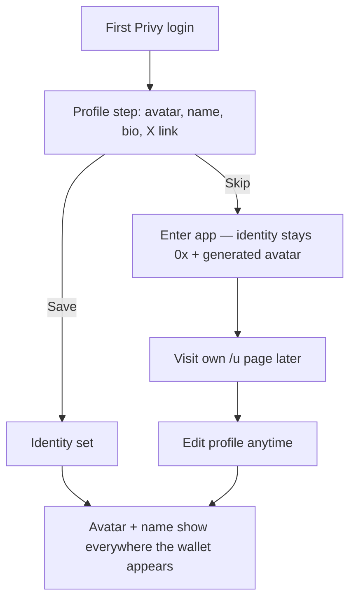

# User Profile Identity (avatar, name, bio) + Onboarding Step

## Problem Frame
Every user on berth.club currently renders as a generated avatar + a truncated
`0xb45c…462e` address — in chat, in "by <creator>" attribution, in holders
lists, and on their own `/u/[address]` page. The app has no editable identity;
everything is derived from chain/indexer data. This makes the product feel
anonymous and less social, which matters for a memecoin launchpad where creator
identity and chat drive virality. We want users to set an avatar + display name
(+ optional bio/social) and have it appear wherever they show up today.

## User Flow

## Requirements

**Profile content**
- R1. A profile has: avatar image, display name, short bio, and one social/X link. All fields optional individually.
- R2. Display names are free-form and non-unique (no handle registry). The 0x address stays visible next to the name wherever identity is shown, as the source of truth against impersonation.
- R3. Avatar upload reuses the existing image-upload → IPFS/Pinata path used by token launches (same consent that art is public + moderated).

**Onboarding**
- R4. After a user's first login, show a one-time profile step (avatar/name/bio/social) that is fully skippable — it never blocks entering the app or trading.
- R5. Skipping leaves the user on the current generated-avatar + address identity; the step does not reappear on every login.

**Surfaces (where identity replaces address + generated avatar)**
- R6. Own profile page `/u/[address]`.
- R7. Chat messages (avatar + name on each comment).
- R8. Creator attribution ("by <creator>") on coin cards and the token page.
- R9. Holders / top-holders lists.
- R10. Resolving identity for these surfaces must work in batch (a single card grid or holders list renders many addresses at once) and fall back cleanly to the generated avatar + short address when a wallet has no profile.

**Editing & ownership**
- R11. A profile is editable anytime from the owner's `/u` page.
- R12. Only the wallet owner (Privy-authenticated as that address) can create or edit their own profile.

**Validation / moderation (minimum)**
- R13. Enforce sane limits: name and bio length caps, no links in the name, single URL field for the social link, image size/type limits. Heavier content moderation is out of scope for v1.

## Success Criteria
- A logged-in user can set an avatar + name in under ~20 seconds and see it reflected on their `/u` page and in chat immediately.
- Users who skip onboarding experience zero added friction to their first trade.
- On any surface with profiles set, users are recognizable by avatar + name rather than a 0x string; unset users still render correctly.
- No measurable drop in first-session activation from adding the onboarding step (because it's skippable).

## Scope Boundaries
- No unique handles / @mention registry (R2).
- No heavy/automated content moderation pipeline for names, bios, or images beyond basic validation (R13).
- No on-chain identity (ENS-style) — this is off-chain app profile data.
- No follows, social graph, DMs, or notifications.
- No profile for wallets that have never authenticated (they keep the derived 0x identity).

## Key Decisions
- Fuller profile (avatar + name + bio + social), not image-only: an avatar next to a raw 0x is only half an identity; the extra fields are low cost.
- Optional/skippable onboarding: conversion of email/wallet users who came to trade outweighs profile-completion rate.
- Free-form non-unique names with address always shown: avoids a handle registry and its collision/rename cost while keeping impersonation legible.
- Reuse existing IPFS upload infra rather than build new.

## Dependencies / Assumptions
- Assumes an off-chain store exists to persist `wallet → {avatar, name, bio, social}` and serve it publicly by address. The comments feature already persists off-chain data, so a store is presumed available to reuse — confirmed during planning.
- Assumes Privy gives a verified authenticated wallet address to gate edits (R12).

## Outstanding Questions

### Deferred to Planning
- [Affects R10][Technical] Which existing store backs comments, and can it hold profiles + serve a batched by-address lookup? Confirm before choosing the persistence approach.
- [Affects R7,R8,R9][Technical] How to batch-resolve identities on server-rendered surfaces (cards, holders) without an N+1 per address.
- [Affects R12][Technical] How to prove wallet ownership for edits with the current Privy setup (session token vs signed message).
- [Affects R13][Needs research] Minimum viable moderation posture for public images/names given the launch flow's existing IPFS-consent pattern.

## Next Steps
→ `/ce:plan` for structured implementation planning
