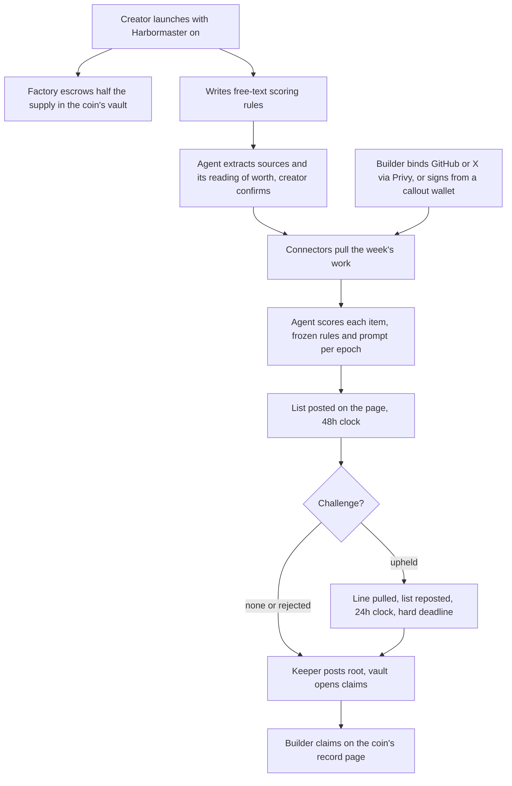

# The Harbormaster: scoring backend and public record

## Problem Frame

`/harbormaster` is a static pitch. It promises an agent that scores work done
for a coin (merged PRs, posts, callouts), publishes a weekly payout list with a
written reason per line, lets anyone challenge a line for 48 hours, then pays
from a vault holding half the coin's supply. None of that exists. There is no
agent, no connector, no epoch state, no vault, and no way for a creator to say
what work counts for their coin.

This document covers the backend and the page: rules entered at launch,
connectors that read the work, the agent that scores it, the weekly epoch, the
challenge flow, the public record, and claims. The vault contract and the
factory path that fills it are another developer's work. This doc specifies
the interface our backend needs from them and nothing about how they build it.

Every epoch pays. There is no dry-run phase.

## Flow

## Participants

| Who | Does | Trusts |
|---|---|---|
| Creator | Opts in at launch, writes rules, can edit them for the next epoch | The agent to read the rules as written |
| Builder | Binds accounts, does work, challenges lines, claims | The list and the reasons |
| Agent (our backend) | Pulls work, scores, answers challenges, signs the root | Nothing from users; the rules, inside a fence (R17) |
| Vault contract (other dev) | Holds half the supply, checks the signer, pays merkle claims | The registered signer, capped at 1% per epoch |
| Operator | Allowlisted berth wallets that can mark a lane skipped | Their own judgment, on the record |
| berth | Runs the keeper key, funds the USDC pot, launches the first coin | Its own ops |

## Requirements

**Rules at launch**
- R1. The launch form gets an opt-in Harbormaster section. Coins launched
  without it are untouched. Opting in escrows the vault at launch regardless
  of whether rules confirm.
- R2. The creator writes the scoring rules as free text: what work counts,
  where (repos, X accounts or hashtags, pump.fun and FOMO pages), and what it
  is worth. Rules text is capped at a few thousand characters. Extraction
  runs are rate-limited per wallet on the comments route's pattern, and their
  budget is separate from the scoring budget.
- R3. Before launch the agent shows back what it extracted: the source list
  per lane and its reading of what counts and the relative worth. The creator
  edits the text and re-runs, or confirms. Extraction that fails or finds no
  sources never blocks the launch: the coin launches with the vault escrowed
  and lands in R4's "rules missing" state.
- R4. Rules bind to the token address after the launch receipt confirms. The
  bind endpoint verifies through the chain or the indexer that the caller is
  the token's deployer and the token came from the Harbormaster launch path.
  The wizard retries the bind until it succeeds. A coin that opted in but
  never bound shows on the token page as "rules missing" to the deployer
  wallet with an attach action that opens the same editor as R5. A coin whose
  rules are never bound keeps half its supply in the vault indefinitely and
  shows "rules missing" on the record every week. That is the deal.
- R5. The deployer wallet can edit rules after launch from the coin's record,
  next to the current rules. Every edit runs the R3 extract-and-confirm before
  it saves as a new version, takes effect from the next epoch, and the record
  shows which version each epoch was scored under.

**Connectors and identity**
- R6. Four lanes in the first epoch: GitHub merged PRs, X posts and articles,
  pump.fun callouts, FOMO callouts. Decided twice against reviewer advice:
  all four ship before epoch one, so a dated feed spike runs first. A lane
  whose feed is not readable ships as "coming" on the page, not as a weekly
  operator skip.
- R7. Every lane emits the same internal event shape (platform, platform user
  id, what, where, when, link). Publishing it as an external spec waits until
  two epochs have run.
- R8. A builder binds a GitHub or X account by linking it through the existing
  Privy login; the server reads the platform user id from Privy's verified
  user record, never from the request body. A pump.fun or FOMO wallet binds by
  signing a message that names the berth wallet, the callout chain, a
  server-issued single-use nonce, and an expiry, scoped to the app domain;
  the server verifies it and burns the nonce. One platform account or wallet
  binds to one berth wallet. No unbinding or transfer in this phase.
- R9. Events and bindings are keyed on the platform's immutable user id or the
  callout wallet, never on a handle, so a reused handle or a transferred
  account cannot inherit another person's work.
- R10. Work by an unbound account is scored and shown under its platform
  handle, marked unclaimed, and excluded from that epoch's root. If the
  account binds within the next epoch, the item is rescored as a line in
  that epoch under that epoch's rules. Otherwise it is dropped and its share
  stays in the vault.
- R11. Each lane records a read status per epoch. A lane that failed to read
  shows as "not read this week" on the list, and the epoch does not publish
  until every enabled lane has read or an operator marks it skipped. An
  operator is an allowlisted berth wallet authenticated through the Privy
  session; each skip is stored with wallet, time and reason, shown on the
  page, and included in the signed list.
- R12. Each lane has a per-epoch item cap and a pre-filter before the scoring
  call, limited to the cap and hard exclusions. Items past the cap are listed
  as unscored with that reason.

**Scoring and epochs**
- R13. Epochs are weekly on one global clock, closing Monday 00:00 UTC, and
  continuous. Weekly was inherited from the page copy rather than chosen;
  it is listed as an open decision because it sets the vault's epoch
  divisor and must be settled before the contract ask. A quiet week publishes an empty list, it does not skip. An epoch still open under challenge does not block the
  next one from publishing.
- R14. Every scored item gets a score, a written reason, and the item ids it
  cites. Zero-score items are listed with their reason.
- R15. The agent treats every connector payload and every challenge body as
  data, never as instructions. It never fetches URLs found in item bodies or
  challenge text; the item set is exactly what the connectors pulled from the
  frozen sources. Output is structured, and a verdict citing anything outside
  the item set is rejected. The raw prompt and output per item are stored.
  Who can read that store is an open question.
- R16. Each epoch freezes the rules version, the extracted sources, and the
  model and prompt identifier it was scored under. Rescoring runs against the
  same frozen inputs plus the challenger's evidence.
- R17. Sybil position for this phase: account age and history feed the score,
  and the agent may zero-score an account created after the coin launched,
  with that reason stated. Nothing else is promised. The page's "Sybil
  defense" pill is reworded to match. The Sybil and structured-output rules
  live above the creator's rules and cannot be overridden by them.
- R17a. The deployer wallet and every account bound to it score zero on their
  own coin, with that reason stated. On the berth coin the same applies to a
  named list of berth team wallets. The vault pays people other than the
  people who wrote the rules.
- R18. The agent does not post verdicts on GitHub or X in this phase. The page
  is the only publication channel.

**Payout and claims**
- R19. Each coin's vault pays in that coin. The cap is 1% of the vault per
  epoch, enforced by the contract, not by us. Every epoch pays the full 1%
  of the vault balance at close, split across lines by score. A week with one
  scoring line pays that line the whole 1%; the creator's rules, the floor in
  R17, and challenges are the defence against a trivial item taking it. An
  epoch with no line above zero pays nothing.
- R20. USDC comes from berth's protocol fee pot and is split across coins pro
  rata to each coin's trading fees that week. berth tops up each coin's vault
  with its USDC share before the root posts, and the USDC rides in the same
  leaf as the coin amount (R37), so one claim collects both.
- R21. After the challenge window closes, the keeper key signs the epoch's
  merkle root and per-line amounts and posts them to the vault from a funded
  keeper wallet. A failed or reverted post is retried, and the list shows
  "posting failed" until it lands. Claims are merkle proofs with an expiry;
  expired claims return to the vault.
- R22. A builder claims from the coin's record page: their own lines, each
  with the coin amount, the USDC amount, and "claim by <date>" read from the
  vault expiry, and one claim action per coin per epoch. The backend stores
  each epoch's leaves and serves the proof for (coin, epoch, wallet). A line
  whose root the indexer has not seen shows as settling with no claim action;
  a claim whose paid event has not arrived shows as pending. The claim button
  reuses the wizard's states: check your wallet, mining with tx link, failed
  with retry and error text, claimed with tx link. Expired lines stay visible
  as "expired, returned to the vault".

**Public record page**
- R23. `/harbormaster` shows, in order: the builder's own lines when the
  wallet has any, then an index of Harbormaster coins ordered by soonest
  settlement (coin, epoch number, line count, countdown), then the rewritten
  pitch. With no Harbormaster coins the pitch is the page. Each coin's record
  lives at `/harbormaster/<token address>` with the current list, scores and
  reasons, the rules and extracted sources, and past epochs. Challenges and
  claims act there. The coin page links to it.
- R24. Rules, sources, reasons and challenge text are stored as-is and
  rendered as text, never as HTML or markdown, matching the comments
  convention.
- R25. Every state has copy: no Harbormaster coins yet; a coin whose first
  epoch is running with no lines; an empty list; a lane not read; a lane
  skipped by an operator; scoring delayed; a list under challenge; a list
  reposted on the 24h clock; a list settled by the hard deadline with
  challenges unanswered; a settled list; posting failed; an item unscored
  past the lane cap; a line pulled after an upheld challenge; a carried line
  from the previous epoch; an unclaimed line expired to the vault; rules
  missing (deployer view).
- R26. Each line shows its score and its share of the epoch's payout for that
  coin as a token amount, so a number means something.
- R27. A logged-out visitor sees one action: bind an account to claim work. A
  logged-in unbound builder sees the binding screen: four platforms, bound
  ones marked; GitHub and X open the Privy link, pump.fun and FOMO ask to
  connect the callout wallet and sign. An account already bound elsewhere
  shows "bound to another wallet". A bound builder sees their own lines,
  claimed and unclaimed.
- R28. The page's pitch copy is rewritten to describe what ships: the vault
  and payout layers say what the contract does, the x402 and airdrop layers
  are labeled as later, "no admin key" becomes an honest description of the
  keeper and multisig, the "posted where the work happened" line comes out
  (R18), and the retroactive-scoring promise is backed by a lookback: epoch
  one reads every lane from a stated start date, the day this page went live. The docs entry and the nav SOON badge follow the
  same gate as "coming soon".
- R29. A list line collapses to a card on narrow screens. The visible
  countdown ticks outside any live region; a separate polite live region
  announces phase changes only (posted, under challenge, reposted, settled)
  and remaining time at hour granularity.

**Challenges**
- R30. A logged-in user can challenge a line on the coin's record with written
  evidence, in an inline form under the line that reuses the comments submit
  states. One open challenge per wallet per line, a per-wallet cap per
  epoch, a per-line cap beyond which further challenges attach to the
  pending rescore, and a 2,000 character body cap, since evidence needs
  more room than a 280 character comment. No per-coin cap: one actor could
  fill it and lock real challengers out. Each
  challenge carries a public status under the line: open, rejected with the
  reason, upheld with the reason and the pulled line. Rejected challenges stay
  visible, collapsed.
- R31. The only remedy is the agent rescoring under R16, at most once per line
  per repost regardless of how many challenges it has. Challenge text goes
  through the same injection judge as the open lanes first. Whether the
  agent "agrees" is a rule measured in a dry run before epoch one, not a
  fixed threshold. If it agrees, the line
  is pulled (shown struck through with the challenge and the reason) and the
  list is reposted with a 24-hour clock. A reposted list accepts challenges
  only on lines whose score or reason changed; a share change from another
  line being pulled is not a change. A hard deadline of publish time plus
  72 hours, bounded by epoch end plus 7 days, settles the list regardless,
  so a late publish keeps its full window. Submitting against a settled or
  unchanged line shows why it is closed instead of a form.
- R32. The agent answers every challenge in public with a reason, upheld or
  not, and may batch-answer duplicates with one reason. Settled lists are
  read-only.

**Trust and operation**
- R33. The agent runs under a berth-held keeper key. The key lives in the
  server secret store with a documented rotation path before epoch one. The
  keeper key and the connector credentials are held only by the process that
  runs the agent, not the web app. TEE hosting is the destination and is not
  part of this phase.
- R34. Every published list is signed by the keeper key. In this phase that
  proves the list is berth's and has not been altered by a third party. It
  does not prove the list is what the agent produced; that needs TEE hosting
  or a public audit store.
- R35. Binding is public by design and the binding screen says so. Unbound
  work shows the platform handle only. An account owner can remove their
  unbound lines after proving ownership the same way a binding does, and
  then chooses remove or claim. A removal is a struck line with the reason
  "removed at owner request" in the signed list.

**Contract interface, what we need from the other developer**
- R36. Launch side: how a launch opts in (a config id, a separate factory, or
  a router entry point), which address emits `TokenLaunched` for it, and how
  a coin's vault is discoverable (event or view). Our wizard, the receipt
  parser and the indexer all depend on that answer.
- R37. Vault: holds half the supply from launch. Exposes one registered signer
  with a rotate callable by a berth multisig, not by the signer. Derives the
  epoch index from time, accepts at most one root per epoch, rejects an epoch
  whose window has not closed, and accepts `(coin, epoch, merkleRoot,
  coinTotal, usdcTotal)` from the signer with coinTotal capped at 1% of the
  vault's coin balance. Holds USDC deposited by berth. Pays merkle claims of
  `(wallet, coinAmount, usdcAmount)` with an expiry, tracks claimed per epoch
  and refuses a claim past that epoch's totals, marks each (epoch, wallet)
  single-use, and puts coin and epoch in the leaf hash so a proof cannot
  replay across epochs or coins.
- R38. Events for root posted, claim paid, and claim expired are all emitted
  from one fixed address: a singleton vault keyed by coin, or a registry that
  re-emits for per-coin vaults. Arc's public RPC caps the indexer's address
  list near twenty and fails silently past it, so per-coin emitting addresses
  are not an option. The ABI ships in `launchpad-contracts-v2/abi/` so the
  generator covers it.

## Success Criteria
- A creator launches with rules in under two minutes and confirms the agent's
  reading of them before signing.
- The first list has a reason on every line that a reader can argue with.
- Two consecutive epochs each pay at least three wallets that are not berth
  team wallets. That gates dropping "coming soon" from the page and the nav.
- At least one challenge from a non-team wallet is answered in public in the
  first four epochs.

## Scope Boundaries
- Not building the vault or factory contracts; R36 to R38 are what we need.
- No airdrop-through-the-agent for outside apps and no x402 review pricing.
- No external connector spec until two epochs have run.
- No in-platform verdict posting on GitHub or X.
- No unbinding or account transfer.
- No changes to the mobile tab bar.

## Key Decisions
- Every epoch pays: the 1% per-epoch cap bounds what a badly scored first
  epoch can lose, and a list that pays nothing gives builders no reason to
  bind. Separately, a coin launched through today's factory can never get a
  vault later, so opting in escrows at launch no matter what.
- berth launches the first coin with rules over its own repos and X account,
  so epoch one does not wait on an outside creator and the GitHub button on
  the page is honest.
- Opt-in per launch: leaves every existing coin's pool economics alone.
- Creator-written free text with a confirm-back of the agent's reading (R3):
  the creator sees how the agent understood worth before launch, not on the
  first public list.
- Challenges on the page only: two of the four lanes have no reply channel.
- Claims on the coin's record page: it is where a builder already sees their
  lines.
- Late binders are rescored in the next epoch rather than carried at a fixed
  amount or paid by a supplementary root, so each epoch's 1% is whole and the
  vault interface stays one root per epoch.
- One global weekly clock: the USDC split is over one shared week and the
  vault derives the epoch index from time.
- Full 1% every epoch, split by score: predictable runway, one rule to
  explain. Accepted that a quiet week concentrates the payout.
- USDC in the same leaf as the coin: one root, one claim, one contract, and
  the cap logic covers both amounts.
- Deployer, bound accounts, and berth team wallets score zero on their own
  coin: the vault exists to pay other people, and the success gate cannot be
  self-fulfilled.
- Four lanes before epoch one, against reviewer advice across two passes:
  the page promised four and the first creator may need any of them.
- Keeper key now, TEE later: the contract only ever checks a registered
  signer, so the swap needs no redeploy.
- No verdict posting on GitHub or X: it needs write credentials on repos
  berth does not own, reads as spam, and no success criterion needs it.

## Dependencies / Assumptions
- Privy supports GitHub and X account linking on the current plan.
- Reading X posts by account and hashtag weekly requires a paid API tier.
- pump.fun and FOMO expose a readable feed of callouts with the calling wallet.
- An LLM API for scoring, with the key in the server secret store and a
  per-epoch budget. When the provider is down at epoch close the epoch shows
  "scoring delayed" rather than publishing.
- Connector credentials (GitHub token, X key, pump.fun and FOMO access) live
  in the same secret store as the keeper key, read-only scoped, each with a
  rotation note.
- A funded keeper wallet for root-posting gas.
- A scheduler for weekly epochs and the 48h and 24h clocks, which neither the
  Next.js app nor Ponder provides today.
- The contracts land with the interface in R36 to R38 before epoch one.

## Outstanding Questions

### Resolve Before Planning
- None.

### Deferred to Planning
- [Affects R6][Needs research] Whether pump.fun and FOMO expose a readable
  callout feed with the calling wallet, or the connector scrapes. On the
  critical path for epoch one.
- [Affects R6][Needs research] Which X API tier covers weekly search by account
  and hashtag, and its cost; and whether the epoch-one X rule needs hashtag
  search at all.
- [Affects R33][Technical] Where the agent runs and stores state. The web app
  and the indexer may or may not share a Postgres; ARCHITECTURE.md and
  AGENTS.md disagree.
- [Affects R15][Technical] Who can read the prompt-and-output store.
- [Affects R9][Technical] Merged-PR attribution: author, co-authors, or merger.
- [Affects R8][Technical] Which Privy linked wallet is the berth wallet for a
  user with both an embedded and an external wallet.
- [Affects R7][Technical] Whether X post bodies are stored, given X terms.
- [Affects R22][Technical] How the page joins indexer coin data with rules,
  scores and claims without an N+1 against the indexer.
- [Affects R11][Technical] Whether a lane-skip is a page action or a database
  flag.

## Next Steps
→ /ce:plan for structured implementation planning.
