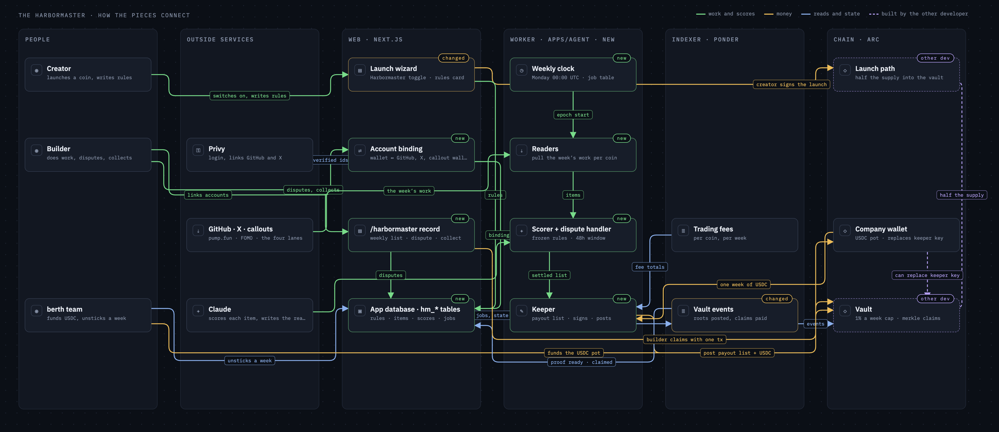

# The Harbormaster

A brief for review. 2026-09-09.

## What it is

Every coin launched on berth.club today puts all of its supply into the trading pool. The Harbormaster is an optional mode a creator can switch on at launch. Half the coin's supply goes into a locked vault instead, and once a week an automated agent pays that vault out to the people who did real work for the coin: code changes accepted on GitHub, posts on X, callouts on pump.fun and FOMO. Every payout comes with a written reason, sits in public for two days so anyone can dispute it, and then is recorded on the blockchain, where anyone can check it.

The page at berth.club/harbormaster already promises this. Nothing behind it exists yet. This plan is how we build it.

## How a week works

1. Monday 00:00 UTC the week starts. The agent freezes the creator's rules so they cannot be changed after seeing the work.
2. All week the agent collects: accepted code changes, posts, and callouts from the accounts and projects the creator named.
3. Monday the week ends. The agent scores every item against the rules and writes a one-paragraph reason for each score, including the zeros.
4. The list goes public for 48 hours. Anyone logged in can dispute a line with evidence. A dispute can only remove a line, never raise one.
5. The list settles. We record the final list on the blockchain, and each builder collects their share with one click from their wallet.

## Where the money comes from and goes

- **The coin.** Half the supply sits in the vault. Each week pays out at most 1% of what is in the vault, split by score. That is roughly a two-year runway.
- **USDC.** berth's own protocol fees fund a weekly USDC pot, divided across Harbormaster coins in proportion to how much trading each coin generated that week. Builders receive both in one claim.
- **Who cannot be paid.** The creator, any account they linked, and berth team wallets on berth's own coin. The vault exists to pay other people.

## How rewards are split

Every piece of work gets a score from 0 to 100 and a written reason, judged against the creator's rules. The week's payout is split in proportion to those scores. If one person fixes a serious bug (scored 80) and another fixes three typos (scored 10 in total), the bug fixer takes most of the week. There are no bounties and no per-task prices; the creator's rules say what matters, the agent weighs each item, and the split follows.

One agent runs every coin. Switching Harbormaster on at launch adds a coin to its Monday list. It does not deploy anything new.

## What we found about the venues

GitHub and X have proper interfaces we can rely on, so they come first. pump.fun has no official interface; we can read its callouts through the same requests its website makes, but that can break without warning and we have to plan for it. FOMO has no interface at all, and nobody has documented how its feed loads, so that lane stays labeled "coming" until we look inside the app ourselves.

## What we build and what we do not

We build the agent, the readers that pull work from GitHub, X, and the callout platforms, the scoring, the weekly clock, the public record page, the dispute flow, and the collect button.

Another developer builds the vault itself, the locked on-chain account that holds the coins, and the launch step that fills it. The first step of our plan is a written one-page ask to them, so both sides agree on every number before either builds.

## What we start with

The build runs in this order. Each step is usable and testable on its own before the next begins.

1. **The written ask to the other developer,** so the vault and our side agree on every number. Alongside it, a quick check that pump.fun and FOMO actually expose a feed we can read.
2. **The database and the always-on service** that keeps the weekly clock.
3. **Account linking and the rules section** in the launch form, so a creator can switch Harbormaster on and a builder can connect their GitHub or X.
4. **The four readers and the scoring,** so the agent can pull a week of work and score it with a written reason.
5. **The weekly cycle and the dispute flow,** plus the controls our team uses to unstick a week.
6. **Settlement:** the payout list, recording it on the blockchain, and the collect button. This is the step that needs the other developer's vault to be live.
7. **The public record pages** and the rewrite of the current pitch copy.

The other developer's vault runs in parallel and must be ready before step 6.

## Decisions we need from you

**One is open.** How much USDC goes into the weekly pot. The options are a fixed share of that week's protocol fees, a fixed weekly amount, or whatever the treasury decides each week. The build does not need the answer until step 6, but the page will show the number, so it should be a rule we can explain.

**Three are made, and you should know them.**

- berth launches the first Harbormaster coin itself, with rules covering berth's own code and the berth X account. Posts about berth by anyone count, so outsiders can earn from week one without writing code.
- All four work lanes ship before the first week, including the two callout platforms whose feeds we have not confirmed yet. If a feed turns out unreadable, that lane is labeled "coming" on the page rather than shipping broken.
- The current page copy changes. "No admin key" becomes an honest description of who holds the key that approves payouts and who can replace it. "Posted where the work happened" comes out; verdicts live on our page only.

## Why weekly

The page said "once a week" before any of this was designed, and every decision since assumed it. Worth stating what the choice actually costs.

Each payout costs the same whether it is large or small: one scoring run, one signature, one transaction. Paying daily would multiply that by seven for the same money. The two-day dispute window also has to fit inside the cycle with room to spare, which it does in a week and would not in a day. And a payout has to be worth more than the small fee a person pays to collect it.

Against it: someone who ships on a Tuesday waits up to thirteen days to be paid, which is slow enough to feel like nothing happened. Weekly also puts the whole supply release into one visible Monday event rather than a trickle.

Nothing technical forces weekly. It is one number on our side and one in the vault. Changing it now is free; changing it after the vault is built is not.

## What could go wrong, in plain words

- **Someone tricks the scorer.** Every input is text written by the people being scored, and some will try to hide instructions to the agent inside it. We treat all of it as evidence, never as instructions, force the agent to answer in a fixed format, and run a second yes/no check on the sources nobody vets. The two-day dispute window catches what slips through.
- **The key that approves payouts leaks.** The vault refuses more than 1% a week no matter who holds the key, the USDC pot stays in the company's shared wallet with only one week's worth moved out at a time, and an hourly check alerts us if a payout appears that we did not approve.
- **A feed goes quiet.** If GitHub or X cannot be read one week, the list waits and says so instead of publishing an empty week that looks real.
- **Nobody outside the team shows up.** The success gate is two consecutive weeks paying at least three wallets that are not ours. Until then the page keeps saying "coming soon".
- **The other developer's contract lands late.** Everything except settlement and claims can be built and tested without it.

## What done looks like

- A creator can launch with Harbormaster on and confirm how the agent read their rules in under two minutes.
- Every line on the first published list has a reason a reader can argue with.
- Two consecutive weeks pay three or more outside wallets. Then "coming soon" comes off the page.
- At least one dispute from an outsider is answered in public in the first four weeks.

## How the pieces connect

Read it left to right. Each column is one place where something runs: the people, the outside services we read from, the website, the new always-on worker that keeps the clock and holds the payout key, the indexer that watches the blockchain, and the chain itself where the other developer's vault lives. Green lines carry work and scores, orange lines carry money, blue lines are reads, dashed purple is the other developer's part.
