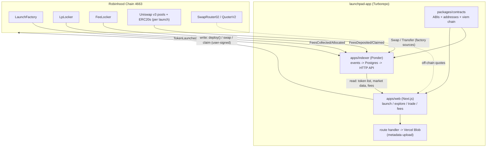
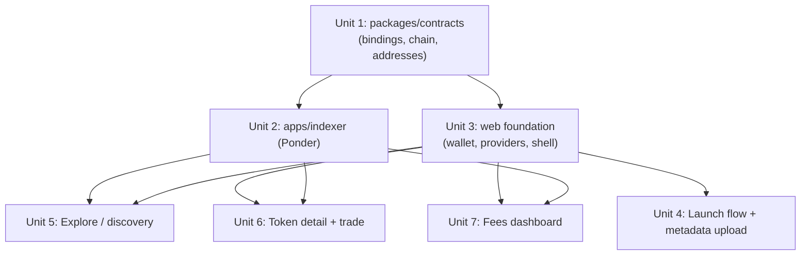

# feat: Arcane Launchpad web app

## Overview

The `launchpad-contracts` system is complete and un-ruggable by design: one `LaunchFactory.deploy()`
call mints an ERC20, pools it on Uniswap v3, locks the LP forever, and optionally does the creator's
first buy. This plan wraps those contracts in a full product: a web app where users **launch** tokens,
**explore/discover** them, **trade** them, and **claim** their accrued LP fees — backed by a
standalone indexer.

The scaffold already exists: `launchpad-app/` is a shadcn Turborepo (pnpm workspaces) with
`apps/web` (Next.js App Router) and `packages/{ui,eslint-config,typescript-config}`. This plan adds a
shared contract-binding package, a Ponder indexer as the separate data backend, and the four user
surfaces.

## Problem Frame

The contracts are only reachable through raw transactions today. Creators can't launch without hand-
crafting calldata; nobody can discover a launched token; fee recipients have no way to see or claim
what the `FeeLocker` owes them. The product's job is to make the launchpad's guarantees legible and
usable without weakening them — the app is a **read/relay layer only**. It never custodies funds,
never holds an admin key over a launched token, and every state-changing action is a user-signed
transaction straight to the contracts.

## Requirements Trace

- R1. A user can launch a token in one flow: name, symbol, image/metadata, optional dev-buy — and see
  the predicted token address before signing (`predictTokenAddress`).
- R2. A user can browse and search all launched tokens with live-ish market data (price, market cap,
  progress toward graduation).
- R3. A user can open a token detail page and buy/sell it in-app via Uniswap `SwapRouter02`.
- R4. A fee recipient (creator or protocol) can see accrued fees and claim them (`FeeLocker.claim` /
  `claimMany`), and trigger a fresh `LpLocker.collectFees` for their position.
- R5. All economics stay contract-defined: the app never sets supply, curve, or fee split — it reads
  them from chain/events.
- R6. The app targets Robinhood Chain (EVM chain ID 4663) using the pinned addresses in
  `launchpad-contracts/src/libraries/Addresses.sol`.

## Scope Boundaries

- **No changes to `launchpad-contracts`.** The one exception worth flagging is documentation drift
  (see Open Questions) — not a code change this plan owns.
- **No custodial features.** No app-managed wallets, no server-side signing, no fee custody.
- **No admin console** for the factory owner in v1. Owner functions (`pause`, `setTicks`, whitelist,
  `setProtocolFeeBps`, `rescue*`) are out of scope; they're operated via cast/script for now.
- **No fiat on-ramp, no bridging.** Users arrive with a funded wallet on chain 4663.
- **Holder lists and full OHLC charts are Phase 2** (see Phased Delivery) — they require the heaviest
  indexing and aren't needed to ship the core loop.

## Design Direction & UI Inspiration

**Vibe: degen / playful** (pump.fun energy), no existing brand — proposal below. The look is
fun-forward and high-density, but the trade surface still has to carry blunt risk signals (this curve
has ~6.9 WETH of total exit liquidity), so "playful" never means "hides the danger."

### Reference products

| Product | Borrow this |
|---|---|
| **pump.fun** | Live "just launched" ticker, king-of-the-hill grid, dense meme-forward cards, one-click quick-buy, confetti/celebration on launch. |
| **four.meme** | Graduation progress bars front-and-center on every card; social/creator attribution. |
| **Moonshot / Sun.pump** | Chunky mobile-first buy panel, quick-amount chips (0.1 / 0.5 / 1 ETH), big number-first price display. |
| **DEX Screener** | Data density done right — sortable columns, sparklines, at-a-glance market stats without feeling cramped. |
| **Uniswap app** | The *trust* half — clean swap ergonomics, slippage clarity, honest price-impact warnings. Steal the rigor, not the restraint. |

### Brand proposal — "Arcane" (from the repo/product name)

Mystical-degen: magic/summoning framing for "launching" a token (a launch is a *summon*, the curve is
a *ritual*, graduation is *ascension*). Leans into the name without being cringe.

- **Palette (dark-first):** near-black base (`#0A0A0F`), elevated panels (`#14141C`), **arcane violet**
  primary accent (`#8B5CF6`→`#A855F7` gradient), **acid green** for gains/success (`#4ADE80`), **hot
  magenta** for CTAs/launch (`#EC4899`), amber/red for risk warnings. Neon-on-dark, glow accents on
  hover.
- **Type:** chunky display face for headings (Clash Display / Space Grotesk), Inter for body,
  **monospace for all numbers** (Geist Mono / JetBrains Mono) — prices, market caps, %s always mono so
  they align and read as data.
- **Motion (framer-motion):** animated number tickers, card hover lift + glow, a live-updating launch
  rail, and a **confetti/summon burst on successful launch**. Motion is a feature here, not decoration
  — it signals "live market."
- **Shape/feel:** rounded-2xl chunky buttons, soft glows, subtle grain/noise texture, emoji- and
  meme-image-friendly cards. Playful but legible.

### Per-screen treatment

- **Explore (home):** dense card grid + a live "🔮 Just Summoned" rail across the top; each card shows
  image, name/symbol, market cap (mono), a **graduation meter** (current tick → `tickUpper`, i.e.
  progress toward the ~6.9 WETH buy-through), holder count, and a quick-buy button. Sort chips
  (newest / market cap / almost-graduated).
- **Launch ("Summon"):** playful stepper — drop image → name/symbol → optional dev-buy with quick
  chips → **live predicted token address** (`predictTokenAddress`) → sign. Confetti + deep-link on
  success. Inline warning if the dev-buy exceeds `maxDevBuyBps`.
- **Token detail:** big mono price + sparkline/chart, a prominent **graduation meter**, chunky buy/sell
  panel with quick-amount chips and clear slippage + **price-impact/exit-liquidity warning** (the ~6.9
  WETH total-exit reality gets an honest amber callout, not fine print), holders, explorer links.
- **Fees ("Spoils"):** simple claimable-balance cards per token, one-tap `claim` / `claimMany`, and a
  separate `collectFees` action with a plain-language explainer of the collect-then-claim split.

### How it maps to the scaffold

The shadcn Turborepo already ships Tailwind + CSS-variable theming (`apps/web/src/styles/globals.css`)
and `packages/ui`. **Unit 3** establishes the theme: define the Arcane tokens as CSS variables
(override the default shadcn palette), add the fonts, and add framer-motion. All surfaces then compose
`packages/ui` primitives themed by those tokens — no bespoke CSS per screen.

> This is design *direction* for the build, not a spec. Final palette hexes, font choices, and motion
> details are a design pass during Unit 3 / each surface — validate against a quick mock before
> committing.

## Context & Research

### Relevant Code and Patterns

- `launchpad-contracts/src/interfaces/ILaunchFactory.sol` — `LaunchConfig {name, symbol, metadataURI,
  devBuyMinOut}`, `deploy()` (payable), `predictTokenAddress()`, and the `TokenLaunched` event
  (token, creator, tokenId, pool, supply, tickLower, tickUpper, protocolFeeBps, devBuyEthIn, name,
  symbol, metadataURI) — carries everything the indexer needs for the token list in one event.
- `launchpad-contracts/src/interfaces/IFeeLocker.sol` + `FeeLocker.sol` — `availableFees[owner][token]`
  mapping (read for the fees dashboard), `deposit`, `claim`, `claimMany`, events `FeesDeposited` /
  `FeesClaimed`.
- `launchpad-contracts/src/LpLocker.sol` — `collectFees(tokenId)` (permissionless, pulls fees from the
  position into the FeeLocker), `recipients(tokenId)`, events `PositionRegistered`, `FeesCollected`,
  `FeesAllocated`, `RecipientUpdated`.
- `launchpad-contracts/src/libraries/Addresses.sol` — the source of truth for chain 4663 addresses:
  `UNISWAP_V3_FACTORY`, `NFPM`, `SWAP_ROUTER_02`, `QUOTER_V2`, `WETH9`, `FEE_TIER = 10000`,
  `TICK_SPACING = 200`. **Do not re-derive these from a block explorer** (the file warns chain 4663 is
  full of impostor contracts).
- `launchpad-contracts/out/` — Foundry build artifacts (ABIs) after `forge build`; the shared binding
  package generates from these, not hand-copied JSON.
- `launchpad-contracts/script/CalcTicks.s.sol` — reference for the tick↔price↔market-cap math the
  "progress to graduation" UI needs.
- Scaffolded app: `apps/web` (Next.js), `packages/ui` (shadcn components), Turborepo `turbo.json`
  tasks (`build`, `dev`, `lint`, `typecheck`).

### Institutional Learnings

- None on file (`docs/solutions/` does not yet exist in this greenfield product repo).

### External References

- **Ponder** (`ponder.sh`) — TypeScript indexer; its **factory pattern** indexes events from
  contracts created by a factory (here: each launched pool and each launched ERC20), which is exactly
  the shape this launchpad produces. Ships a queryable HTTP API (GraphQL + SQL-over-HTTP) so the web
  app needs no separate API service.
- **wagmi / viem** — custom chain definition for 4663; `useReadContract`/`useWriteContract`,
  multicall for batched reads.
- **Uniswap `IV3SwapRouter` (SwapRouter02)** — note from the contracts: `exactInputSingle` has **no
  deadline field** (selector `0x04e45aaf`); deadlines are enforced via `multicall`. The trade UI must
  not pass a deadline arg. `QUOTER_V2` is used **off-chain** for quotes and dev-buy sizing.

## Key Technical Decisions

| Decision | Rationale |
|---|---|
| Monorepo: `apps/web` + `apps/indexer` + `packages/contracts` | User chose "Next.js frontend + separate backend." Turborepo already scaffolded; the indexer is the separate backend, shared bindings avoid ABI drift. |
| Indexer = **Ponder** with factory pattern | The `TokenLaunched` event is a factory event; Ponder's factory sources index per-pool `Swap` and per-token `Transfer` without hardcoding addresses. Built-in API removes a whole API-service unit. |
| Web reads market data **only** from the indexer API; writes go **direct to contracts** via wagmi | Clean split: indexer owns history/discovery; the chain owns truth for signing. No server relays a user transaction. |
| Custom viem chain for Robinhood 4663; addresses imported from `packages/contracts` | Single source of truth mirrored from `Addresses.sol`; kills the "which WETH is real" impostor risk. |
| ABIs **generated** from `launchpad-contracts/out/` (wagmi CLI / abitype), committed to `packages/contracts` | Type-safe reads/writes; regenerate when contracts change; no hand-maintained JSON. |
| Metadata upload via a **Next.js route handler** using Vercel Blob (image + JSON), `metadataURI` = returned URL | Uploading needs a secret key, so it must be server-side; a route handler keeps it in `apps/web` without a third service. IPFS/Pinata is a drop-in swap later (see Open Questions). |
| Dev-buy sizing via `QUOTER_V2` **off-chain**, `devBuyMinOut` computed client-side | The contracts explicitly intend this; the buy executes atomically at a price the same tx chose, so slippage risk is nil and `minOut` is a UX guard. |
| Wallet: RainbowKit (or ConnectKit) over wagmi | Standard, least custom code; must register the 4663 chain. |
| **All Ethereum primitives imported from `viem`** — types, ABIs, encoding, units, clients, chain def | Single library for the whole app + indexer. No `ethers`/`web3.js` anywhere. Use viem's `Address`/`Hash`/`Hex` types, `parseEther`/`formatUnits`, `parseAbi`/`encodeFunctionData`, `createPublicClient`, `defineChain`. wagmi and Ponder are both viem-native, so this keeps one type system end to end. |

## Open Questions

### Resolved During Planning

- **Which chain?** Robinhood Chain 4663 (user decision). Use `Addresses.sol` verbatim.
- **Data layer?** Ponder indexer + Postgres (user decision), serving the web app directly.
- **Do we need a separate API service?** No — Ponder's built-in HTTP API is the backend. Add custom
  endpoints inside the Ponder app only if a query can't be expressed in its API.
- **Where does metadata live?** Vercel Blob behind a route handler for v1; pluggable.

### Deferred to Implementation

- **Deployed contract addresses.** `LaunchFactory` / `LpLocker` / `FeeLocker` are not yet deployed to
  4663. The app is buildable against a local anvil/fork, but going live needs a real deploy
  (`launchpad-contracts/script/Deploy.s.sol`) and the resulting addresses wired into
  `packages/contracts`. Treat as a prerequisite for staging, not for starting the units.
- **RPC + explorer endpoints for chain 4663.** Need a reliable JSON-RPC URL (for both wagmi and
  Ponder) and the block-explorer base URL for tx/address links. Confirm during Unit 1.
- **Does chain 4663 RPC support the log/trace range queries Ponder needs?** Verify against the real
  endpoint before committing to Ponder's historical backfill depth.
- **Price/market-cap display math** — exact tick→price→WETH-market-cap formula and decimals handling,
  finalized against `CalcTicks.s.sol` when building Unit 5/6.
- **Contract documentation drift (flag, not owned here):** `Addresses.sol` says chain 4663 while
  `LaunchFactory._devBuy` reasons about "Arbitrum Nitro." We plan against 4663; someone should
  reconcile the stale comment in the contracts repo separately.

## High-Level Technical Design

> *This illustrates the intended approach and is directional guidance for review, not implementation
> specification. The implementing agent should treat it as context, not code to reproduce.*

## Implementation Units

- [ ] **Unit 1: Shared contract bindings package (`packages/contracts`)**

**Goal:** One type-safe source of truth for ABIs, deployed addresses, the 4663 viem chain, and shared
helpers (tick↔price), consumed by both `apps/web` and `apps/indexer`.

**Requirements:** R5, R6

**Dependencies:** `launchpad-contracts` builds (`forge build` produces `out/`).

**Files:**
- Create: `packages/contracts/package.json`, `packages/contracts/src/index.ts`
- Create: `packages/contracts/src/chain.ts` (viem `defineChain` for 4663: id, RPC, explorer, WETH as
  native-wrapped)
- Create: `packages/contracts/src/addresses.ts` (mirror of `Addresses.sol` + deployed launchpad
  addresses, keyed so testnet/local overrides are possible)
- Create: `packages/contracts/src/abis/` (generated) + `packages/contracts/wagmi.config.ts` (wagmi CLI
  reads `launchpad-contracts/out/`)
- Create: `packages/contracts/src/units.ts` (tick→price→market-cap + WETH/token formatting helpers)
- Test: `packages/contracts/src/units.test.ts`

**Approach:**
- Generate ABIs with `@wagmi/cli` from Foundry artifacts; commit output so consumers don't need Foundry.
- `addresses.ts` exports Uniswap constants copied from `Addresses.sol` (with a comment pointing back to
  it as canonical) and a `launchpad` block (`factory`, `lpLocker`, `feeLocker`) filled from the deploy.
- Chain def uses the RPC/explorer confirmed in Open Questions.

**Patterns to follow:** wagmi CLI `foundry` plugin config; existing `packages/typescript-config` for
tsconfig extension.

**Test scenarios:**
- Happy path: `tickToPrice(DEFAULT_TICK_LOWER)` and `(DEFAULT_TICK_UPPER)` produce the ~0.216 / ~219
  WETH market-cap bounds documented in `LaunchFactory` (within tolerance).
- Edge case: negative unaligned tick and exact spacing multiples (200) format without precision loss;
  `TOTAL_SUPPLY` (1e29) market-cap math doesn't overflow JS number handling (use bigint).
- Edge case: address map returns the exact `Addresses.sol` constants (assert byte-equality) — guards
  against a typo silently pointing at an impostor contract.

**Verification:** `apps/web` and `apps/indexer` both import types/addresses from this package with no
duplicate ABI JSON anywhere; `units.test.ts` passes.

---

- [ ] **Unit 2: Indexer backend (`apps/indexer`, Ponder)**

**Goal:** Index every launch and its downstream activity into Postgres and expose a query API for the
web app.

**Requirements:** R2, R4, R5

**Dependencies:** Unit 1.

**Files:**
- Create: `apps/indexer/ponder.config.ts` (chain 4663 RPC; `LaunchFactory`, `LpLocker`, `FeeLocker` as
  contracts; **factory sources** for per-launch pool `Swap` and ERC20 `Transfer`)
- Create: `apps/indexer/ponder.schema.ts` (tables: `token`, `launch`, `feeBalance`, `feeEvent`,
  `swap` [Phase 2 for full history])
- Create: `apps/indexer/src/index.ts` (event handlers)
- Create: `apps/indexer/.env.example` (RPC URL, `DATABASE_URL`)
- Test: `apps/indexer/src/index.test.ts` (Ponder's test harness / handler unit tests)

**Approach:**
- `TokenLaunched` → upsert `token` (address, creator, pool, tokenId, ticks, protocolFeeBps, name,
  symbol, metadataURI, supply, createdAt) — a single event fully populates a discovery row.
- `FeesCollected` / `FeesAllocated` (LpLocker) and `FeesDeposited` / `FeesClaimed` (FeeLocker) →
  maintain `feeBalance[owner][token]` mirroring on-chain `availableFees`, plus a `feeEvent` log.
- Factory source: register each launched `pool` for `Swap` (drives price/last-trade/graduation) and
  each launched ERC20 for `Transfer` (Phase 2 holder counts).
- Serve via Ponder's built-in HTTP API; add a custom endpoint only if discovery sort/filter needs it.

**Execution note:** Verify the 4663 RPC supports Ponder's historical log range before committing to a
deep backfill window.

**Test scenarios:**
- Happy path: a `TokenLaunched` log produces exactly one `token` row with every field mapped from the
  event (no extra chain reads needed for the discovery row).
- Integration: `FeesDeposited` then `FeesClaimed` for the same (owner, token) nets `feeBalance` back to
  0 — mirrors `FeeLocker.availableFees` after a claim.
- Edge case: two launches by the same creator with identical name/symbol (allowed via `deployNonce`)
  index as two distinct `token` rows (distinct addresses), not one overwrite.
- Integration: a `Swap` on a launched pool updates the token's latest price/last-traded fields.

**Verification:** Querying the API after replaying a block range returns the launched tokens with
correct market fields and fee balances matching on-chain `availableFees`.

---

- [ ] **Unit 3: Web foundation — wallet, chain, providers, shell**

**Goal:** App-wide wallet connection on chain 4663, data-fetching provider, and the navigation shell
the four surfaces mount into.

**Requirements:** R1–R4 (enabling), R6

**Dependencies:** Unit 1.

**Files:**
- Create: `apps/web/src/lib/wagmi.ts` (wagmi config with the 4663 chain from `packages/contracts`)
- Create: `apps/web/src/app/providers.tsx` (wagmi + RainbowKit + React Query providers)
- Create: `apps/web/src/lib/indexer.ts` (typed client for the Ponder API)
- Modify: `apps/web/src/app/layout.tsx` (wrap in providers), add nav shell using `packages/ui`
- Create: `apps/web/src/components/connect-button.tsx`, `apps/web/src/components/chain-guard.tsx`
  (prompt to switch to 4663)
- Modify: `apps/web/src/styles/globals.css` (Arcane theme tokens — override shadcn palette), add
  display + mono fonts; add `framer-motion` dependency (see Design Direction)
- Test: `apps/web/src/lib/indexer.test.ts`

**Approach:**
- Register only chain 4663; `chain-guard` surfaces a "wrong network" state and a switch action.
- `indexer.ts` centralizes API base URL + query typing so surfaces don't hand-roll fetches.

**Patterns to follow:** shadcn layout/nav components already in `packages/ui`; Next.js App Router
provider-wrapping pattern (`'use client'` providers mounted in `layout.tsx`).

**Test scenarios:**
- Happy path: indexer client parses a token-list response into typed objects.
- Error path: indexer client surfaces a fetch/HTTP error as a rejected query React Query can render as
  an error state (not a silent empty list).
- Integration: `chain-guard` renders the switch prompt when the connected chain ≠ 4663.

**Verification:** App boots, wallet connects, wrong-network prompt appears on any other chain, and a
sample indexer query renders.

---

- [ ] **Unit 4: Launch flow + metadata upload**

**Goal:** The create-token experience: form → metadata upload → address preview → `deploy()` with
optional dev-buy → confirmation.

**Requirements:** R1, R5

**Dependencies:** Unit 3.

**Files:**
- Create: `apps/web/src/app/launch/page.tsx` and `apps/web/src/components/launch/launch-form.tsx`
- Create: `apps/web/src/app/api/metadata/route.ts` (route handler: accept image + fields, store to
  Vercel Blob, return `metadataURI`)
- Create: `apps/web/src/lib/launch.ts` (build `LaunchConfig`, call `predictTokenAddress`, size dev-buy
  via `QUOTER_V2`, compute `devBuyMinOut`, submit `deploy` with `value`)
- Test: `apps/web/src/lib/launch.test.ts`, `apps/web/src/app/api/metadata/route.test.ts`

**Approach:**
- Two-step submit: (1) upload metadata → get URI; (2) `predictTokenAddress(user, config)` to preview
  the token address (contracts expose this specifically for frontends); (3) `deploy(config)` with
  `msg.value` = chosen dev-buy ETH.
- Dev-buy sizing: quote via `QUOTER_V2` off-chain, apply a slippage tolerance to derive `devBuyMinOut`;
  warn if the intended buy exceeds the on-chain `maxDevBuyBps` cap (read from factory) since `deploy`
  reverts with `DevBuyExceedsCap`.
- Surface tx lifecycle (pending/success/revert) and, on success, deep-link to the new token page.

**Execution note:** Start the metadata route handler with a failing test for the upload contract
(multipart in → `{ url }` out).

**Test scenarios:**
- Happy path: valid form → `LaunchConfig` built with the uploaded `metadataURI`; `deploy` called with
  the expected `value`.
- Edge case: zero dev-buy (`msg.value = 0`) omits the buy and `devBuyMinOut` is irrelevant — flow still
  completes.
- Error path: dev-buy sized above `maxDevBuyBps` is blocked client-side with a clear message before
  signing (don't let the user pay gas for a guaranteed `DevBuyExceedsCap` revert).
- Error path: metadata route rejects a non-image / oversized upload with a 4xx; form shows the error.
- Edge case: `predictTokenAddress` returns zero address (mining failure, ~6e-6) → surface a retry
  rather than proceeding.

**Verification:** On a local fork, a full launch produces a `TokenLaunched` event the indexer picks up,
and the previewed address matches the deployed token.

---

- [ ] **Unit 5: Explore / discovery**

**Goal:** Browse, search, and sort all launched tokens with live-ish market data.

**Requirements:** R2

**Dependencies:** Units 2, 3.

**Files:**
- Create: `apps/web/src/app/page.tsx` (or `/explore`) and
  `apps/web/src/components/explore/token-grid.tsx`, `token-card.tsx`
- Create: `apps/web/src/lib/queries.ts` (indexer queries: list, search, sort by recent / market cap)
- Test: `apps/web/src/components/explore/token-grid.test.tsx`

**Approach:**
- Read entirely from the indexer API (no direct chain reads in the list view). Card shows name/symbol,
  image (from metadata), price, market cap, and progress-to-graduation derived from current tick vs
  `tickUpper`.
- Polling/refetch interval for "live-ish"; infinite scroll or paging for scale.

**Test scenarios:**
- Happy path: a list response renders one card per token with formatted price/market cap.
- Edge case: empty state (no launches yet) renders a clear zero-state, not a spinner forever.
- Edge case: token with unreachable/broken `metadataURI` image falls back to a placeholder.
- Happy path: sort toggles (newest / market cap) re-query and reorder.

**Verification:** After several test launches, all appear, searchable and sortable, with sane market
numbers.

---

- [ ] **Unit 6: Token detail + trade**

**Goal:** Per-token page with market stats and in-app buy/sell via `SwapRouter02`.

**Requirements:** R3

**Dependencies:** Units 2, 3.

**Files:**
- Create: `apps/web/src/app/token/[address]/page.tsx` and
  `apps/web/src/components/token/trade-panel.tsx`, `token-stats.tsx`
- Create: `apps/web/src/lib/trade.ts` (quote via `QUOTER_V2`; `exactInputSingle` buy/sell; WETH
  wrap/unwrap; approvals)
- Test: `apps/web/src/lib/trade.test.ts`

**Approach:**
- Stats from indexer + a live `slot0`/quote read for current price. Progress bar = current tick vs
  `[tickLower, tickUpper]`.
- Trade: buy = WETH→token, sell = token→WETH, both `exactInputSingle` on `SWAP_ROUTER_02`.
  **No deadline arg** (SwapRouter02 has none; wrap in `multicall` if a deadline is ever required).
  Compute `amountOutMinimum` from the `QUOTER_V2` quote × slippage. Handle ERC20 approval for sells.
- Link out to the block explorer for the pool, token, and locked position.

**Test scenarios:**
- Happy path: a buy builds `exactInputSingle` params with `amountOutMinimum` derived from the quote and
  the correct `fee` tier (10000).
- Edge case: sell path requests/uses an ERC20 approval before swapping when allowance is insufficient.
- Error path: quote failure or zero-liquidity (price already at `tickUpper`) disables the buy with a
  message instead of submitting a doomed tx.
- Edge case: slippage tolerance boundary — `amountOutMinimum` computed at the exact tolerance rounds
  in the user's favor (never rounds up past the quote).
- Assert the trade builder never includes a `deadline` field (guards against re-introducing the wrong
  router ABI).

**Verification:** On a fork, buy then sell round-trips against a launched pool; balances and the price
bar update.

---

- [ ] **Unit 7: Fees dashboard**

**Goal:** Let a fee recipient see and claim accrued fees, and trigger a fresh collection for their
position.

**Requirements:** R4

**Dependencies:** Units 2, 3.

**Files:**
- Create: `apps/web/src/app/fees/page.tsx` and `apps/web/src/components/fees/fees-table.tsx`
- Create: `apps/web/src/lib/fees.ts` (read `availableFees` / indexer `feeBalance`; `collectFees`,
  `claim`, `claimMany`)
- Test: `apps/web/src/lib/fees.test.ts`

**Approach:**
- List the connected wallet's claimable balances per token (indexer `feeBalance`, cross-checked with a
  direct `availableFees` read for the amounts being signed).
- Two actions: `LpLocker.collectFees(tokenId)` (permissionless — moves fees from the position into the
  FeeLocker) and `FeeLocker.claim(owner, token)` / `claimMany(owner, tokens)` (pays the owner).
- Make clear these are independent: collecting tops up `availableFees`; claiming withdraws it.

**Test scenarios:**
- Happy path: wallet with balances in 3 tokens shows 3 rows; `claimMany` batches them.
- Edge case: nothing to claim → zero-state; `claim` on a zero balance is disabled (contract reverts
  `NothingToClaim`).
- Integration: after `collectFees(tokenId)`, the dashboard reflects the increased `availableFees`
  before claiming.
- Edge case: `claimMany` skips tokens with zero balance (matches contract's skip-don't-revert
  behavior) rather than failing the whole batch.

**Verification:** On a fork, generating pool fees → `collectFees` → `claim` moves tokens to the
recipient and the dashboard zeroes the row.

## System-Wide Impact

- **Interaction graph:** Web writes hit `LaunchFactory.deploy`, `SwapRouter02.exactInputSingle`,
  `LpLocker.collectFees`, `FeeLocker.claim/claimMany` — all user-signed, no server relay. Web reads hit
  the Ponder API and occasional direct chain reads (quotes, `availableFees`, `slot0`).
- **Error propagation:** Contract reverts (`DevBuyExceedsCap`, `NothingToClaim`, `PoolAlreadyExists`,
  slippage) must map to human messages; pre-flight the known ones (dev-buy cap, zero balance) client-
  side to avoid wasted gas.
- **State lifecycle risks:** Indexer lag vs chain truth — always sign against a fresh direct read for
  amounts (fees, quotes), treat the indexer as display/discovery. Reorgs: rely on Ponder's reorg
  handling; don't cache tx-derived state beyond what it reconciles.
- **API surface parity:** `packages/contracts` is the only place ABIs/addresses live; web and indexer
  must not diverge. Regenerate bindings whenever `launchpad-contracts` changes.
- **Integration coverage:** The launch→index→display and collect→claim loops cross app/indexer/chain
  boundaries and need fork/e2e coverage, not just unit mocks.
- **Unchanged invariants:** The app changes nothing on-chain. It cannot pause launches, move a
  position, re-cut a split, or redirect fees — and must never present UI implying it can. The
  contracts' rug-impossibility guarantees are preserved precisely because the app is read/relay only.

## Risks & Dependencies

| Risk | Mitigation |
|------|------------|
| Contracts not yet deployed to 4663 | Build/test against local anvil or a fork; gate staging on running `Deploy.s.sol` and wiring addresses into `packages/contracts`. |
| Chain 4663 RPC may not support Ponder's log-range backfill | Verify early (Unit 2 execution note); fall back to a shorter backfill window or a proxied archive RPC. |
| Wrong/impostor Uniswap or WETH address | Import addresses only from `packages/contracts`, mirrored from `Addresses.sol`; unit-assert byte-equality; never look up by name on the explorer. |
| SwapRouter02 ABI drift (deadline field) | Trade builder test asserts no `deadline`; use the `IV3SwapRouter` ABI from generated bindings, not v3-periphery's original router. |
| Indexer/chain divergence at signing time | Sign against fresh direct reads for amounts; indexer is display-only. |
| Metadata abuse (malicious images/links) | Route handler validates type/size; add moderation/reporting in Phase 2. |
| Market-cap/graduation math errors | Cross-check `packages/contracts/units` against `CalcTicks.s.sol` outputs in tests. |

## Phased Delivery

### Phase 1 (core loop)
Units 1–4 (bindings, indexer, foundation, launch) then Units 5–7 (explore, detail+trade, fees). Ships
the full R1–R4 experience with price/market-cap/graduation from `Swap`-driven indexing.

### Phase 2 (depth)
Holder lists and counts (ERC20 `Transfer` factory source), full OHLC charts (swap history table),
metadata moderation/reporting, and an optional owner/admin console for factory governance.

## Documentation / Operational Notes

- `apps/indexer/.env.example` and `apps/web/.env.example` document RPC URL, `DATABASE_URL`, Blob token,
  and the launchpad/Uniswap addresses source.
- Deploy: `apps/web` on Vercel; `apps/indexer` (Ponder) needs a persistent Node host + Postgres
  (Ponder is stateful — not a serverless fit). Wire the web app's indexer base URL to it.
- Regeneration runbook: after any `launchpad-contracts` change, `forge build` then regenerate
  `packages/contracts` ABIs.

## Sources & References

- Contracts: `launchpad-contracts/src/{LaunchFactory,LpLocker,FeeLocker,LaunchToken}.sol` and
  `src/interfaces/*`, `src/libraries/Addresses.sol`
- Tick math reference: `launchpad-contracts/script/CalcTicks.s.sol`
- Indexer: Ponder (`ponder.sh`) factory pattern
- On-chain integration: wagmi/viem, Uniswap `IV3SwapRouter` (SwapRouter02), `QUOTER_V2`
