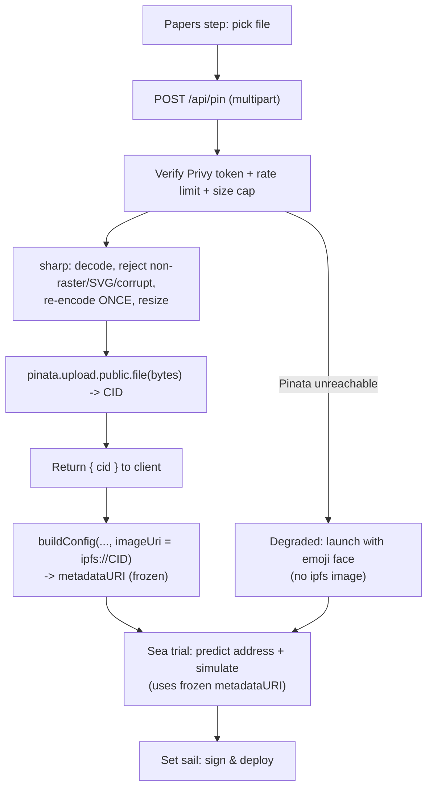
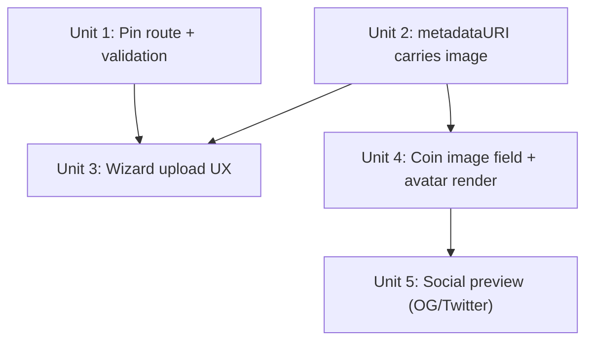

> **Implementation status (2026-07-18):** all 5 units implemented on branch
> `feat/coin-image-upload`. Verified: pure logic self-checks (metadata
> determinism, ipfsToGateway, image validation incl. SVG rejection), the pin
> route's auth gate (401/503), OG meta at runtime, tsc + build + lint. **Pending
> live verification** (needs a Pinata scoped key + gateway host + PRIVY_APP_SECRET
> and a connected wallet): the full upload happy path — pick → pin → CID → render,
> and the required-vs-degraded gating with a real Privy token.

# feat: Coin image upload (Pinata / IPFS)

## Overview

Let a creator upload a coin image at launch. The image is pinned to IPFS through
a **server-side** route (Pinata), and the resulting `ipfs://CID` is written into
the coin's on-chain `metadataURI` `image` field. The image becomes the coin's
visual identity across the app and in shared-link previews. The emoji face
survives only as a fallback — for coins launched before this feature, for
render-time load failures, and for the degraded path when Pinata is unreachable.

This rides entirely on the **existing v1.1 deployed factory** — `metadataURI` is
already a constructor arg the factory accepts; nothing on-chain changes.

## Problem Frame

Coin identity today is one of sixteen emoji faces on a tinted tile. For a
memecoin launchpad, a distinct image *is* the product — memorable and shareable
(see origin: `docs/brainstorms/2026-07-17-coin-image-upload-requirements.md`).
`buildMetadataURI` already embeds an `image` field (a DiceBear placeholder) with
a code comment anticipating this exact swap.

## Requirements Trace

Carried from the origin requirements doc (R1–R11):

- **R1** Uploaded image is the coin's avatar across harbor card, token page, portfolio.
- **R2** Fallback (emoji/generated) applies to any coin whose metadata has **no uploaded `ipfs://` image**, and to render-time load failures. Existing coins carry a non-uploaded DiceBear `https` image, so the gate is the `ipfs://` scheme specifically.
- **R3 / R3a** One client avatar component: renders `` with `onError` → emoji fallback, loading-vs-failed distinction, `object-fit: cover`, alt text. Replaces ~5 inline `{coin.emoji}` sites. `Coin` gains an `image` field populated in `toCoin` gated on `ipfs://`.
- **R4** Image required to launch **when Pinata is reachable**; outage is the exception (R6).
- **R5** CID known **before** address prediction; baked into `metadataURI` and reused byte-identically through deploy (load-bearing CREATE2 constraint).
- **R6** Failure splits: rejected file → back to picker; Pinata outage → **degraded emoji-only launch**, surfaced honestly.
- **R7** Mechanical validation: raster allowlist (png/jpeg/webp/gif), **exclude SVG**, verify by decoded magic bytes (not client Content-Type), reject zero-byte/corrupt, cap size/dimensions.
- **R8** Wizard interaction states: uploading indicator, block advancing until CID resolves, lock picker mid-upload, post-upload preview from a local object URL (not the gateway), replace affordance.
- **R9** Best-effort pinning on a maintained Pinata account; CID on-chain so durability can be upgraded later.
- **R11** Shared coin links render the coin's art via OpenGraph/Twitter-card meta.

Deferred P2s from the origin doc, resolved here (see Key Technical Decisions):
predicted-address integrity, upload-endpoint auth/rate-limiting, no-recovery for a bad/lost image.

## Scope Boundaries

- **No content moderation** (non-goal) — any raster image is accepted and rendered. Mechanical validation (R7) is not moderation.
- **No guaranteed permanence** — best-effort pinning only (R9). No second pinning provider / Filecoin backing in v1.
- **No admin takedown / hide-image** surface in v1.
- **No in-app image editing/cropping** beyond the server-side re-encode/resize R7 needs.
- **No contract change** — uses the existing `metadataURI` arg on the live v1.1 factory. Independent of any v1.3 redeploy.
- **No composed OG card** (name+price+logo drawn onto a template) in v1 — pass the raster image through (R11); a composed `opengraph-image.tsx` is a later upgrade.

## Context & Research

### Relevant Code and Patterns

- `apps/web/lib/launch.ts` — `buildMetadataURI(name, ticker, lore, emoji)` builds the `data:application/json` URI; `image` field currently a DiceBear placeholder with a "swap for ipfs://" comment. `buildConfig` → `LaunchConfig.metadataURI`. **CREATE2 constraint**: this string feeds the predicted address; `predict` and `deploy` must see byte-identical input.
- `apps/web/components/launch-wizard.tsx` — 3-step wizard (Papers → Sea trial → Set sail). `config` is `React.useMemo`'d from name/ticker/lore/emoji; `useLaunch(config, valueWei, step === 1)` runs the predict/simulate on the review step. Emoji picker (`FACE_OPTIONS`) lives in the Papers step.
- `apps/web/lib/indexer.ts` — `parseMetadata` **already returns `image`** in `CoinMeta`; `toCoin` maps only `emoji` and **drops `meta.image`**. This is the real change site, not `parseMetadata`.
- `apps/web/lib/coin.ts` — `Coin` type (no `image` field yet); `FACE_OPTIONS`.
- `apps/web/components/coin-avatar.tsx` — `CoinAvatar` renders emoji in an `aria-hidden` span; **currently unused** (zero call sites). The ~5 real sites inline `{coin.emoji}`: `app/page.tsx`, `app/token/[address]/page.tsx`, `app/u/[address]/page.tsx`, `components/portfolio-tabs.tsx`, `components/token-card.tsx`.
- `apps/web/lib/chain.ts` — home for a small `ipfsToGateway(uri)` helper (mirrors `explorerTx`).
- `apps/web/app/token/[address]/page.tsx` — server component, `export const dynamic = "force-dynamic"`, async; **no `generateMetadata`** yet. Target for R11.
- Auth: **Privy** is already wired (`@privy-io/react-auth` 3.35.1, `@privy-io/wagmi` 4.0.14). The client can mint an access token; the server can verify it.
- Env convention: server-only vars unprefixed (`INDEXER_URL`); client vars `NEXT_PUBLIC_*`.
- **Test convention:** no test runner is installed. The repo verifies pure logic with assert-based self-checks run via `node --experimental-strip-types` (`lib/chart.selfcheck.ts`, `apps/indexer/lib/ticks.ts`). Plan test scenarios follow that: pure helpers get a `*.selfcheck.ts`; behaviors that need a running server are enumerated for manual/harness verification (see Deferred to Implementation).

### External References

- **Next.js 16.2 (framework research):** route handlers run `nodejs` by default — **edge runtime is deprecated in 16**, do not set it. Route-handler bodies buffer to a **10 MB default**, tunable via `experimental.proxyClientMaxBodySize` in `next.config.ts` (new in 16). `request.formData()` yields a web `File`; forward it into a new `FormData` — no disk write. Per-page social preview: **`generateMetadata` passing an absolute image URL through** is the right mechanism when the image already exists as a hosted URL (our IPFS case); `opengraph-image.tsx`/`ImageResponse` is only for dynamically-composed cards. For **untrusted** remote images, prefer a plain `` or `next/image` `unoptimized` — avoids the optimizer allowlist, the `dangerouslyAllowSVG` trap, and a known Next 16 `remotePatterns` bug (#88873). `remotePatterns` (optimizer allowlist) and CSP `img-src` (browser allowlist) are enforced by different parties; the app has no CSP today.
- **Pinata / IPFS (best-practices research):** use the current `pinata` npm SDK (not deprecated `@pinata/sdk`); `pinata.upload.public.file(file)` server-side with a server-only JWT. The JWT is a bearer credential — possession = full account access; never ship it client-side. A server proxy converts "credential theft" into "open pin endpoint," which is still an abuse vector → gate on **authenticated caller** (not a spoofable wallet address in the body), per-caller rate limit in a store that survives restarts, global size/volume caps, and a **Pinata scoped key + dedicated group** for blast-radius control. **Reject SVG** (stored-XSS when served from a gateway); allowlist raster, verify by **decoded magic bytes**, and **re-encode server-side (sharp)** to strip payloads and normalize. **CID determinism:** a CID hashes the encoded DAG, not the raw file — but this is a non-issue if ordered correctly: re-encode **once**, pin those exact bytes, put the returned CID on-chain; never re-encode after. Use a **dedicated Pinata gateway** (not public) with hotlink/origin restrictions for rendering. "Best-effort pinning" = retrievable while the pin is maintained; the on-chain pointer is permanent, availability is not.

## Key Technical Decisions

- **Server-side upload route, not client-side.** A browser-exposed Pinata JWT can pin arbitrary content to the account. The route is also the only place to enforce content validation before bytes are pinned. (Resolves origin deferred: upload location.)
- **Gate the route on a verified Privy token, not a raw wallet address.** Privy is already wired and issues a verifiable access token; a wallet address in the request body is spoofable. Avoids building SIWE from scratch. (Resolves origin P2: upload-endpoint auth.)
- **In-memory per-wallet rate limit + hard size cap for v1.** The app runs as a **single long-running Railway instance**, so in-memory counters persist (the usual "serverless cold start resets it" objection doesn't apply here). Upgrade to Upstash/Redis only if it scales to multiple instances. Plus a global daily pin ceiling as a backstop. (Resolves origin P2: rate-limiting.)
- **sharp: decode → validate → re-encode once → resize.** One server-side pipeline satisfies R7 (raster allowlist, magic-byte verification, SVG exclusion, zero-byte/corrupt rejection, dimension cap) *and* produces the canonical bytes that get pinned. Re-encoding once and freezing the result is exactly what makes the CID — and thus the predicted address — stable. (Resolves origin P2: predicted-address determinism.)
- **Metadata stays inline `data:application/json`, with `image: "ipfs://CID"`.** Only the image goes on IPFS. Keeps metadata explorer-readable and lets the indexer keep reading it straight from the launch event (no gateway fetch). (Resolves origin deferred: metadata encoding.)
- **Render untrusted images with a plain `` (or `next/image unoptimized`).** No optimizer allowlist, no SVG optimizer trap, no #88873. Set explicit dimensions to avoid layout shift. (Resolves origin deferred: gateway rendering + Next-image config.)
- **Fallback gate is the `ipfs://` scheme, not "has an image field."** Existing coins already carry a DiceBear `https` image; gating on presence would flip every existing coin from its emoji to a shape. (From document-review of the origin doc.)
- **Predicted-address integrity via CID-in-config ordering.** `metadataURI` is undefined until the CID exists; replacing the image resets the CID and forces re-prediction. The memoized `config` key includes the CID, so `useLaunch` re-simulates on change and never shows/sign against a stale address. (Resolves origin P2: back-nav re-prediction.)
- **No post-launch image recovery in v1 (accepted).** `metadataURI` is immutable and pinning is best-effort; the wizard's replace-before-sign affordance (R8) covers wrong-file-before-launch, and a lapsed pin degrades to the fallback avatar. Documented, not mitigated. (Resolves origin P2: no-recovery.)

## Open Questions

### Resolved During Planning

- **Upload location?** Server-side route handler (`app/api/pin/route.ts`).
- **Metadata encoding?** Inline `data:` JSON with `ipfs://CID` image field.
- **Gateway / image rendering?** Dedicated Pinata gateway; plain ``/`unoptimized`.
- **OG mechanism?** `generateMetadata` pass-through of the absolute gateway URL.
- **Caller auth?** Verified Privy access token.
- **CID determinism vs resize?** Re-encode once server-side, pin those bytes, freeze.
- **Rate-limit store?** In-memory (single Railway instance) for v1.

### Deferred to Implementation

- Exact `ipfs://` predicate — `startsWith("ipfs://")` vs stricter CID validity — and where it lives (`toCoin` vs render component). Lean: normalize in `toCoin`.
- Exact R7 numeric limits (max bytes, max dimensions, output format webp vs png) — pin during implementation against sharp defaults and the render-tile size.
- Pinata scoped-key + group setup and the `PINATA_JWT` / gateway host env values — an operational/credential step (dependency below), not code.
- Whether to add a real test runner (vitest) for the route handler, or verify its behaviors manually against the enumerated scenarios. The repo currently has none; pure helpers use `*.selfcheck.ts`.
- Whether to tie a pin to an in-progress launch record (so the route isn't a generic public pinning service). Nice-to-have; out of v1 unless cheap.

## High-Level Technical Design

> *This illustrates the intended approach and is directional guidance for review, not implementation specification. The implementing agent should treat it as context, not code to reproduce.*

Upload + launch data flow (happy path), showing where the CID is frozen relative to signing:

## Implementation Units

Dependency graph (non-linear — Unit 4/5 render, Unit 1/2/3 launch):

- [x] **Unit 1: Pinata upload route + validation/re-encode pipeline**

**Goal:** A server route that authenticates the caller, validates + re-encodes an image, pins it, and returns only the CID.

**Requirements:** R5, R7, R9 (+ origin P2s: auth, rate-limit, determinism)

**Dependencies:** None (foundation). New deps: `pinata`, `sharp`, `@privy-io/server-auth`.

**Files:**
- Create: `apps/web/app/api/pin/route.ts` (POST handler)
- Create: `apps/web/lib/pin-image.ts` (pure-ish: validate + re-encode via sharp; magic-byte/type gate; the CID-producing `pin()` wrapper)
- Create: `apps/web/lib/pin-image.selfcheck.ts` (assert-based checks for the validation/decoding logic that doesn't need network)
- Modify: `apps/web/next.config.ts` (`experimental.proxyClientMaxBodySize`)
- Modify: `apps/web/package.json` (deps), `.env.example` (`PINATA_JWT`, `NEXT_PUBLIC_IPFS_GATEWAY`)

**Approach:**
- `nodejs` runtime (do not set edge — deprecated in Next 16). `POST(request)`, `request.formData()`, `form.get("file")` as `File`.
- Verify a Privy access token from the request (`Authorization` header) with `@privy-io/server-auth` before doing any work; reject unauthenticated with 401.
- Per-wallet in-memory rate limit + global daily counter; reject over-limit with 429.
- Validate: reject missing file, size over cap (also set `proxyClientMaxBodySize`), then **decode with sharp** — reject anything that isn't a real png/jpeg/webp/gif (this rejects SVG, HTML-polyglots, zero-byte/corrupt by construction, independent of the client `Content-Type`).
- **Re-encode once** to a normalized raster (webp or png), resized to a max dimension. These exact bytes are what gets pinned.
- `pinata.upload.public.file(reencodedFile)` with the server-only `PINATA_JWT`; return `{ cid }`.

**Execution note:** Start the `pin-image.ts` validation logic test-first via its `.selfcheck.ts` (the security-critical surface).

**Patterns to follow:** env convention (unprefixed server var); `lib/chart.selfcheck.ts` for the assert-self-check shape.

**Test scenarios:**
- Happy path: a valid PNG → decodes, re-encodes, returns a CID; the pinned bytes equal the re-encoded bytes.
- Edge case: a GIF/WebP/JPEG each accepted; a 1×1 and a large-but-in-cap image both accepted and resized.
- Error path — SVG disguised as PNG: a file with `.png` name / `image/png` Content-Type but SVG/XML bytes → **rejected** by the decoder (magic-byte gate), never pinned.
- Error path — zero-byte / truncated / non-image bytes → rejected.
- Error path — oversized file (> cap) → 413/rejected before pinning.
- Error path — missing/invalid Privy token → 401, no pin.
- Error path — over rate limit for a wallet → 429, no pin.
- Error path — Pinata call fails/times out → route returns a distinct error the client can map to the degraded path (not a generic 500 that looks like a bug).
- Determinism: the same re-encoded bytes are what the returned CID addresses (pin input == hash input); re-encode happens exactly once.

**Verification:** Posting a valid raster returns a CID and the image resolves at `https://<gateway>/ipfs/<cid>`; an SVG and an oversized/corrupt file are refused; an unauthenticated request is refused.

- [x] **Unit 2: `metadataURI` carries the uploaded image**

**Goal:** `buildMetadataURI`/`buildConfig` write `ipfs://CID` into the `image` field when an upload exists, keeping determinism.

**Requirements:** R5, R2 (data side)

**Dependencies:** None (can land before/parallel to Unit 1). Consumed by Unit 3.

**Files:**
- Modify: `apps/web/lib/launch.ts` (`buildMetadataURI`, `buildConfig` signatures gain an optional `imageUri`)
- Modify/Create: `apps/web/lib/launch.selfcheck.ts` (byte-identical determinism check)

**Approach:**
- `buildMetadataURI(name, ticker, lore, emoji, imageUri?)`: when `imageUri` is present, set `image: imageUri` (the `ipfs://CID`); when absent (degraded launch), keep the current placeholder path or omit — decide so the R2 fallback gate (`ipfs://`) reads it correctly. Keep key order fixed (determinism).
- `buildConfig` threads `imageUri` through.

**Patterns to follow:** existing `buildMetadataURI` (fixed key order, `data:` URI, `encodeURIComponent`).

**Test scenarios:**
- Happy path: with `imageUri = ipfs://X`, the emitted JSON has `image: "ipfs://X"`; without it, no `ipfs://` image is emitted.
- Determinism (Edge): same inputs → byte-identical string across calls (the property `predict`/`deploy` rely on).
- Edge case: lore/emoji/name with URL-unsafe characters still encode identically.

**Verification:** A launch built with an `imageUri` produces a `metadataURI` whose parsed `image` is the `ipfs://CID`, and repeated builds are byte-identical.

- [x] **Unit 3: Launch wizard upload UX + degraded path**

**Goal:** File picker in the Papers step with the full R8 interaction states, CID wired into the config before prediction, and the degraded emoji-only launch on Pinata outage.

**Requirements:** R4, R5, R6, R8

**Dependencies:** Unit 1 (route), Unit 2 (`buildConfig` signature)

**Files:**
- Modify: `apps/web/components/launch-wizard.tsx`
- Create: `apps/web/lib/use-image-upload.ts` (client hook: holds file, object-URL preview, upload state, returned CID; calls `/api/pin` with the Privy token)

**Approach:**
- Papers step gains a file picker. On select: show a local `URL.createObjectURL(file)` preview immediately; upload in the background.
- Uploading state: indicator on the image slot, **block advancing to Sea trial** until the CID resolves, lock the picker mid-upload.
- Success: keep the object-URL preview (not the gateway — a just-pinned CID can briefly 404), expose a **replace** affordance that discards the CID and returns to picking.
- Thread the CID into the memoized `config` (`buildConfig(..., imageUri)`), so `config`'s memo key includes the CID → replacing the image re-runs `useLaunch` predict/simulate (predicted-address integrity).
- Required-when-up: block "Set sail" without a CID **unless** the upload failed due to a Pinata outage, in which case offer "Art upload is unavailable right now — launch with an emoji face instead?" and proceed with no `imageUri` (emoji picker stays for this path).

**Execution note:** UI-state heavy; the CID-in-config ordering is the load-bearing correctness point — verify the previewed address changes when the image is replaced.

**Patterns to follow:** existing wizard step/gating logic and `useLaunch` memoization in `launch-wizard.tsx`; Privy `getAccessToken` for the authed fetch.

**Test scenarios:**
- Happy path: pick image → preview shows → upload completes → can advance → predicted address reflects the CID.
- Integration: replacing the image after reaching Sea trial changes the CID → the shown predicted address updates (never stale/lying).
- Error path — rejected file (Unit 1 refuses): error shown, stays on picker, cannot advance.
- Error path — Pinata outage: degraded prompt appears, creator can launch with an emoji face, `metadataURI` carries no `ipfs://` image.
- Edge case: advancing is blocked while an upload is in flight.

**Verification:** A creator can upload, preview, replace, and launch with an image; when the route reports an outage, they can still launch with an emoji face and are told why.

- [x] **Unit 4: `Coin.image` + client avatar component + render sites**

**Goal:** Surface the uploaded image on `Coin` and render it everywhere through one client avatar component with the R3a behaviors, gated on `ipfs://`.

**Requirements:** R1, R2, R3, R3a

**Dependencies:** Unit 2 (metadata shape). Independent of Units 1/3.

**Files:**
- Modify: `apps/web/lib/coin.ts` (`Coin` gains `image: string | null`)
- Modify: `apps/web/lib/indexer.ts` (`toCoin` maps `meta.image` **gated on `ipfs://`**; helper to normalize)
- Modify: `apps/web/lib/chain.ts` (add `ipfsToGateway(uri)` — `ipfs://CID` → `https://<NEXT_PUBLIC_IPFS_GATEWAY>/ipfs/CID`)
- Modify: `apps/web/components/coin-avatar.tsx` (make it a **client** component accepting `image?`, `emoji`, `name`, `ticker`, `size`; render `` with `onError`→emoji, loading state, `object-fit: cover`, `alt="{name} ({ticker}) logo"`)
- Modify (route through `CoinAvatar`): `apps/web/app/page.tsx`, `apps/web/app/token/[address]/page.tsx`, `apps/web/app/u/[address]/page.tsx`, `apps/web/components/portfolio-tabs.tsx`, `apps/web/components/token-card.tsx`
- Create: `apps/web/lib/chain.selfcheck.ts` (or extend) for `ipfsToGateway`

**Approach:**
- `toCoin`: `image = meta.image?.startsWith("ipfs://") ? meta.image : null` — this is the R2 gate that keeps DiceBear-generation coins on their emoji.
- `CoinAvatar`: plain `` (untrusted content, per decision), explicit width/height from `size`, `onError` swaps to the emoji tile, brief loading treatment so a slow gateway isn't shown as broken, alt text also labels the fallback.
- Replace each inline `{coin.emoji}` span with `<CoinAvatar image={coin.image} emoji={coin.emoji} name={coin.name} ticker={coin.ticker} size={…} />`, preserving each site's tile size/classes.

**Test scenarios:**
- Happy path: a coin with `image = ipfs://X` renders the gateway ``; a coin with `image = null` renders the emoji tile.
- Edge case (`ipfsToGateway`): `ipfs://CID` → correct `https://<gateway>/ipfs/CID`; a non-`ipfs://` input returns null/does not build a URL (self-check).
- Edge case — existing DiceBear-generation coin (metadata has `https` image): `toCoin` yields `image = null` → still shows emoji (no silent regression).
- Error path — image 404s at render: `onError` falls back to the emoji tile (behavioral; verify in the app).
- Accessibility: the `` and fallback expose `alt="{name} ({ticker}) logo"`.

**Verification:** New image-bearing coins show their art on harbor/token/portfolio; existing coins are unchanged on their emoji; a broken image URL falls back cleanly.

- [x] **Unit 5: Social preview (OpenGraph / Twitter cards)**

**Goal:** Shared coin links render the coin's image + name/ticker.

**Requirements:** R11

**Dependencies:** Unit 4 (`ipfsToGateway`, `Coin.image`)

**Files:**
- Modify: `apps/web/app/token/[address]/page.tsx` (add `generateMetadata`)
- Modify: `apps/web/app/layout.tsx` (set `metadataBase`; sensible default OG for imageless coins)

**Approach:**
- `export async function generateMetadata({ params })`: `await params`, `fetchCoin(address)`, and if it has an `ipfs://` image, return `openGraph.images` / `twitter: { card: "summary_large_image", images: [...] }` with the **absolute** `ipfsToGateway(image)` URL. Pass name/ticker as title/description.
- Imageless coins (degraded/legacy) → a default site OG card. Set `metadataBase` once in `layout.tsx` as insurance for any relative URL.
- Do **not** add `opengraph-image.tsx` (that's for composed cards — out of scope).

**Test scenarios:**
- Happy path: token page for an image-bearing coin emits `og:image` / `twitter:image` = the absolute gateway URL, `summary_large_image`.
- Edge case: an imageless coin emits the default card, not a broken/empty `og:image`.
- Integration: the emitted URL is absolute (crawler-usable), verified against a real coin address.

**Verification:** A coin link pasted into a card-rendering tool (or X/Discord) shows the coin's image and name/ticker; an imageless coin shows the default card.

## System-Wide Impact

- **Interaction graph:** new `/api/pin` route (first `app/api` in the app); Privy token verification path server-side; `buildMetadataURI` gains a parameter consumed by the wizard; `toCoin` gains a field consumed by 5 render sites and `generateMetadata`.
- **Error propagation:** the route must distinguish *rejected file* (client fixes it) from *Pinata outage* (degraded launch) from *unauthorized* (401) so the wizard maps each to the right UX — a generic 500 would wrongly read as a bug and block launches.
- **State lifecycle risks:** the CID must be frozen into `config` before prediction and re-frozen on replace; a stale CID → a predicted address that doesn't match deploy. The memo key including the CID is the guard.
- **API surface parity:** any future non-wizard launch path must also set the `image` field, or those coins fall back to emoji (acceptable, but note it).
- **Unchanged invariants:** the deployed v1.1 factory and its `metadataURI` handling are untouched; the indexer's `parseMetadata` is untouched (already returns `image`); existing coins keep their emoji identity (R2 gate). Metadata stays inline `data:` JSON — the indexer still reads it from the event with no network fetch.

## Risks & Dependencies

| Risk | Mitigation |
|------|------------|
| Pinata JWT leaks to the client | Server-only route; unprefixed env var; JWT never in a client component or bundle. |
| Open pin endpoint abused (free pinning / cost) | Privy-auth gate + per-wallet rate limit + size/global caps + Pinata scoped key & group. |
| SVG / polyglot stored-XSS via gateway | Raster allowlist, magic-byte decode, server re-encode (sharp); dedicated gateway = separate origin. |
| Re-encode after CID chosen → on-chain CID mismatches pinned bytes | Re-encode exactly once, freeze; no later re-pin/thumbnail regen of launch images. |
| Replacing image after prediction shows a stale address | CID is part of the memoized `config` key → `useLaunch` re-predicts on change. |
| Existing coins flip from emoji to DiceBear shape | R2 gate is the `ipfs://` scheme, not "has an image field." |
| Pinata outage blocks all launches | Degraded emoji-only launch path (R6). |
| Lapsed pin 404s a coin's image permanently | Accepted (R9); on-chain CID lets a stronger backing be added later without a contract change. |
| **Dependency:** Pinata account, scoped key + group, dedicated gateway host | Operational prerequisite before Unit 1 can run end-to-end; `PINATA_JWT` (server) + `NEXT_PUBLIC_IPFS_GATEWAY` (client) env values. |
| **Dependency:** `@privy-io/server-auth` for token verification | New dep in Unit 1. |
| No test runner for the route handler | Pure logic via `*.selfcheck.ts`; route behaviors enumerated for manual/harness verification (deferred: whether to add vitest). |

## Documentation / Operational Notes

- Add the Pinata env vars to `.env.example` and the Railway service config (`PINATA_JWT` server-only; `NEXT_PUBLIC_IPFS_GATEWAY` public).
- Provision the Pinata scoped key (upload-only), a dedicated group for launch images, and gateway hotlink/origin restrictions before enabling uploads in production.
- Keep the pin/account active — best-effort availability depends on it (R9).

## Sources & References

- **Origin document:** [docs/brainstorms/2026-07-17-coin-image-upload-requirements.md](../brainstorms/2026-07-17-coin-image-upload-requirements.md)
- Related code: `apps/web/lib/launch.ts`, `apps/web/lib/indexer.ts` (`toCoin`/`parseMetadata`), `apps/web/components/coin-avatar.tsx`, `apps/web/components/launch-wizard.tsx`, `apps/web/lib/chain.ts`
- Prior plan: `docs/plans/2026-07-15-001-feat-launchpad-web-app-plan.md`
- External: Next.js 16 route handlers / `generateMetadata` / `proxyClientMaxBodySize` / Image `remotePatterns`; Pinata `pinata` SDK, scoped keys, gateway access controls; IPFS CID content-addressing; SVG-upload stored-XSS.
