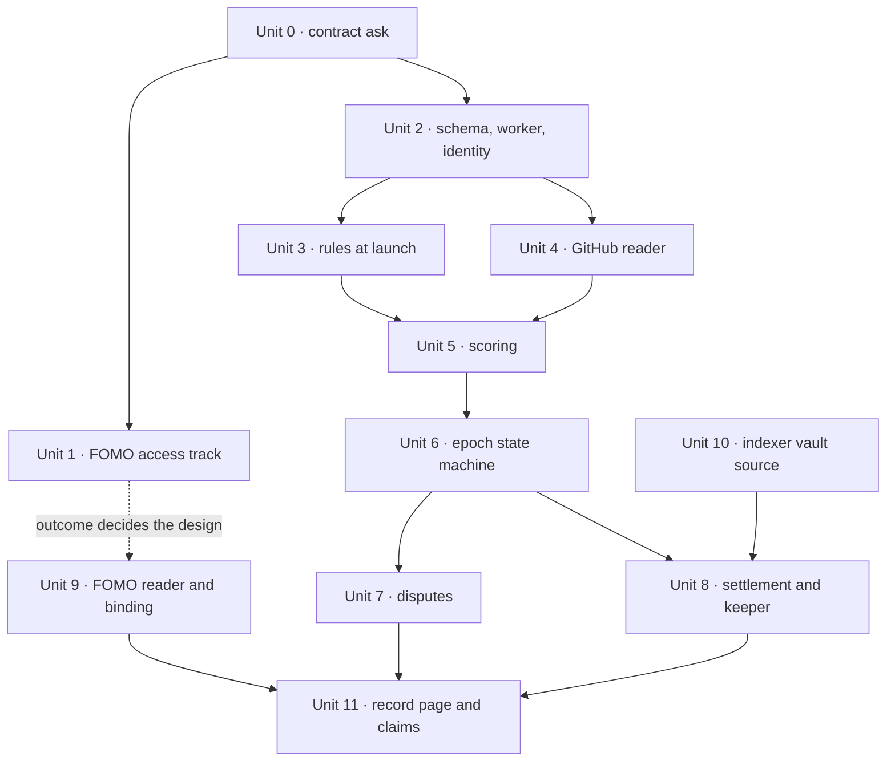

# feat: Harbormaster, GitHub and FOMO first

## Overview

The same system as the full plan, narrowed to two venues: GitHub and FOMO.
X and pump.fun are deferred. Everything else holds, including the weekly
clock, the scoring, the dispute window, the vault, and the claim.

The narrowing is not symmetric, and the plan is shaped around that. GitHub
is the most proven lane we have: a real interface, permanent account ids,
and a merged change already names its author. FOMO is the least proven:
no public interface, no documentation, nobody has recorded how its feed
loads, and its users hold Privy embedded wallets with no wallet app, so
the signature binding designed for pump.fun does not work there.

So the two lanes get different treatment. GitHub carries a complete,
paying system on its own. FOMO is an additive lane behind an access gate,
and the gate is a conversation with FOMO, not an engineering task.

## Problem Frame

`/harbormaster` promises an agent that pays for work. Nothing behind it
exists. The full plan (see supersedes) covered four venues; this one
covers the two the team chose to start with, and is otherwise the same
system with fewer readers.

What this plan adds on top of the full plan:

- GitHub ships first and alone. The first paying week needs no FOMO.
- A FOMO access track that runs in parallel from day one, because it is a
  partnership dependency with a lead time we do not control.
- Three named outcomes for that track, each with a different FOMO lane
  design, so the work is not blocked on which one lands.

## Requirements Trace

| Origin | Covered by |
|---|---|
| R1 to R5 rules at launch | Unit 3 |
| R6 lanes, narrowed to GitHub and FOMO | Unit 4, Unit 9 |
| R7 to R12 event shape, identity, read status, caps | Unit 2, Unit 4, Unit 9 |
| R13 to R18 scoring and epochs | Unit 5, Unit 6 |
| R19 to R22 payout and claims | Unit 8, Unit 10 |
| R23 to R29 record page | Unit 11 |
| R30 to R32 disputes | Unit 7 |
| R33 to R35 trust and operation | Unit 2, Unit 8 |
| R36 to R38 contract interface | Unit 0, Unit 10 |

Deferred with the lanes: the X reader, the pump.fun reader, the
Sign-In-With-Solana binding, and the open connector spec.

## Scope Boundaries

- No X lane and no pump.fun lane. The event shape stays the same so each
  is one reader when its turn comes.
- No vault or factory Solidity. Unit 0 is the ask.
- No airdrop-through-the-agent, no x402 pricing.
- No published connector spec.
- No changes to the mobile tab bar.
- No gas relayer for embedded-wallet claimers.

## Key Technical Decisions

- **GitHub is the whole system's proof.** Every unit up to and including
  the first real payout runs on GitHub alone. If FOMO access never lands,
  the Harbormaster still works, pays, and is honest on the page. This is
  the single most important shape of the plan.
- **The FOMO access track starts on day one and runs in parallel.** It is
  a conversation, not a task, so it has a lead time we do not control.
  Starting it late is what makes it the critical path.
- **Three FOMO outcomes, three lane designs.** Named up front so Unit 9
  can be built against whichever lands, rather than waiting for certainty:
  - *Cooperative.* FOMO gives us a read path for callouts with the calling
    wallet, and enables Privy cross-app so their users can bind. Best case,
    and the ask in Unit 1 is written to make it easy to say yes to.
  - *Partial.* A readable feed but no cross-app. Callouts are scored and
    shown under the FOMO handle, and they pay only once that person binds
    some other account. Lines sit unclaimed until then.
  - *None.* No readable feed. The lane ships labeled "coming" on the
    record page, and the page copy says which venues actually pay. No
    scraping of a logged-in session, because it breaks silently and puts
    our bot credentials somewhere they should not be.
- **FOMO binding is not a wallet signature.** FOMO users hold Privy
  embedded wallets whose keys never leave FOMO's app, so the
  Sign-In-With-Solana flow from the full plan fails for most of them.
  Privy cross-app is the mechanism if FOMO enables it; otherwise the
  person binds a GitHub account instead and their FOMO lines attach to
  that wallet.
- Everything else carries over from the full plan unchanged: one worker
  for all coins, payout proportional to score, one global weekly clock
  (still an open decision, see below), unbound items rescored next epoch,
  pull-only disputes, keeper transactions signed and persisted before
  broadcast, the wallet pinned once per user, public proofs checked
  against the indexed root, and a database trigger freezing financial rows
  once a payout is on chain.

## Open Questions

### Resolve before Unit 0

- [Affects R13, R37][User decision] Weekly, or something else. It becomes
  a divisor inside the vault, so it must be settled before the contract
  ask goes out. Carried from the full plan, unchanged.
- [Affects Unit 1][User decision] Who owns the FOMO conversation, and is
  there an existing relationship? The answer sets whether the access track
  is a warm ask or a cold one, which changes its lead time by weeks.

### Resolve before Unit 8

- [Affects R20][User decision] The weekly USDC pot rule. Carried from the
  full plan, unchanged.

### Deferred to implementation

- Whether Privy's `github_oauth.subject` is GitHub's numeric id. Verified
  in Unit 2 before Unit 4 keys on it.
- Merged-PR attribution: author, co-authors, or merger.
- Where the agent runs and stores state.
- Which Privy linked wallet is the berth wallet for a user with both an
  embedded and an external one.
- Whether FOMO callouts carry a chain and an address at all, which the
  Unit 1 track answers.

## High-Level Technical Design

> Directional guidance for review, not implementation specification.

Two tracks from day one. The left one ships a paying system. The right one
decides what the FOMO lane can be.

The dashed edge is the point of the whole shape: Unit 9 consumes Unit 1's
answer but nothing else waits on it.

## Implementation Units

### Phase 0: the two asks

- [ ] **Unit 0: Contract interface ask**

**Goal:** One document the contracts developer builds against.

**Requirements:** R36, R37, R38

**Dependencies:** The weekly cadence decision.

**Files:**
- Create: `docs/harbormaster-contract-interface.md`

**Approach:**
- Unchanged from the full plan: leaf shape with coin and USDC amounts,
  epoch derived from block time, one root per epoch, the cap measured net
  of outstanding unclaimed, a permissionless no-op-safe sweep, a signer
  with a multisig-only rotate and no withdraw path, a multisig pause, and
  every event from one fixed address.
- Add the launch-side ask: how a launch opts in, which address emits
  `TokenLaunched` for that path, and how a coin's vault is discoverable.

**Test scenarios:**
- Test expectation: none. This is a document.

**Verification:**
- The contracts developer confirms each item in writing before Unit 10.

- [ ] **Unit 1: FOMO access track**

**Goal:** A written answer to what the FOMO lane can actually be, early
enough that Unit 9 is never the thing holding up a release.

**Requirements:** R6, R8

**Dependencies:** None. Starts on day one and runs alongside everything.

**Files:**
- Create: `docs/harbormaster-fomo-access.md`

**Approach:**
- Two asks to FOMO, written so either can be granted alone:
  1. A read path for callouts that includes the calling wallet and the
     chain. A webhook, an endpoint, or a periodic export all work.
  2. Privy cross-app enabled for their app id, so a berth page can request
     a signature from a user's FOMO wallet through a Privy prompt.
- In parallel, a hands-on check that costs nothing: log in to FOMO, post a
  callout, and record what the app requests when the feed and any
  notification load, whether the poster's address appears, and whether a
  bot session can read it.
- Write the outcome as one of the three named in Key Technical Decisions,
  with the evidence. That document is Unit 9's input.
- Do not build against unofficial endpoints or a scraped logged-in
  session. Both break silently, and the plan's whole posture is that a
  lane which cannot be read says so.

**Test scenarios:**
- Test expectation: none. This is research with a written outcome.

**Verification:**
- The document names one of the three outcomes and the evidence for it,
  before Unit 9 starts.

### Phase 1: foundation

- [ ] **Unit 2: Schema, shared db package, worker, identity**

**Goal:** The tables, the always-on worker, and a wallet that owns a
GitHub account. One unit because none of the three is useful alone.

**Requirements:** R7 to R12, R33, R35

**Dependencies:** None

**Files:**
- Create: `packages/db/package.json`, `packages/db/src/schema.ts`,
  `packages/db/src/client.ts`, `packages/db/drizzle.config.ts`
- Move: `apps/web/drizzle/` and its journal into `packages/db/drizzle/`
- Create: `apps/agent/` (package, tsconfig, Dockerfile, `src/index.ts`,
  `src/env.ts`, `src/clock.ts`, `src/jobs/loop.ts`,
  `src/jobs/registry.ts`, `src/migrations.ts`), `apps/agent/railway.json`,
  `railway.agent.json`
- Create: `apps/web/lib/privy-auth.ts`, `apps/web/lib/bindings.ts`,
  `apps/web/app/api/harbormaster/bindings/route.ts`,
  `apps/web/components/harbormaster-bind.tsx`
- Modify: `apps/web/lib/db/schema.ts`, `apps/web/package.json`,
  `apps/web/Dockerfile`, `apps/indexer/Dockerfile`, `docker-compose.yml`,
  `pnpm-workspace.yaml`, `packages/contracts/src/index.ts`, `AGENTS.md`
- Test: `packages/db/src/schema.check.ts`,
  `apps/agent/src/jobs/loop.check.ts`, `apps/agent/src/clock.selfcheck.ts`,
  `apps/agent/src/migrations.check.ts`, `apps/web/lib/bindings.check.ts`,
  `apps/web/lib/privy-auth.check.ts`

**Approach:**
- Schema, constraints and the freeze trigger exactly as the full plan's
  Unit 1, minus the callout-wallet columns on `hm_bindings` and minus
  `hm_nonces`, which only the Solana binding needed. Keep both if the
  FOMO track looks like it will land cooperative; they are two small
  tables and removing them later is additive.
- Worker loop exactly as the full plan's Unit 2: claim one job with
  `FOR UPDATE SKIP LOCKED`, handlers return `done`, `failed` or
  `wait(until)`, migration equality gate with a heartbeat and an
  error-level line after fifteen minutes, restricted Postgres role,
  redacted errors, and job bootstrap on the first tick.
- Identity: the wallet is pinned once per Privy user in `hm_users`,
  filtered to an ethereum wallet and validated as an address. GitHub
  binding through the existing Privy login, keyed on the immutable
  subject. The binding screen shows GitHub as available and FOMO as
  pending until Unit 1 resolves.

**Test scenarios:**
- Happy path: two migrations, no `DROP`, trigger present.
- Edge case: duplicate binding on platform and subject fails; duplicate
  job on type, coin, epoch, key fails.
- Error path: updating a leaf after the epoch is posted raises; updating
  that epoch's item content succeeds.
- Happy path: a due job runs once; two loop instances each run it once;
  a handler returning `wait` leaves attempts unchanged.
- Happy path: the gate polls when the journal matches and waits when it
  does not, logging at error level after fifteen minutes.
- Happy path: sync for a user with linked GitHub inserts one binding with
  that subject and the pinned wallet; twice is idempotent.
- Edge case: user pins wallet A, unlinks A, links B; every later check
  still uses A.

**Verification:**
- The worker boots against compose, waits for migrations, then runs a
  seeded job once. One real Privy account links GitHub and the stored
  subject looks numeric, which gates Unit 4's key choice.

### Phase 2: a coin, its rules, and its work

- [ ] **Unit 3: Rules at launch**

**Goal:** A creator switches Harbormaster on, writes rules, and those
rules end up bound to the coin.

**Requirements:** R1 to R5

**Dependencies:** Unit 2, Unit 0

**Files:**
- Create: `apps/web/app/api/harbormaster/rules/extract/route.ts`,
  `.../rules/draft/route.ts`, `.../rules/bind/route.ts`,
  `.../rules/route.ts`, `apps/web/lib/rules.ts`,
  `apps/web/lib/resolve-sources.ts`, `apps/agent/src/jobs/extract.ts`,
  `apps/web/components/harbormaster-rules-card.tsx`,
  `apps/web/components/harbormaster-rules-editor.tsx`
- Modify: `apps/web/components/launch-wizard.tsx`, `apps/web/lib/launch.ts`,
  `apps/web/app/token/[address]/page.tsx`, `apps/web/lib/server-env.ts`
- Test: `apps/web/lib/rules.check.ts`,
  `appsis/web/lib/resolve-sources.selfcheck.ts`,
  `apps/agent/src/jobs/extract.check.ts`

**Approach:**
- Unchanged from the full plan's Unit 4, with one simplification: the
  rules only name GitHub repos and FOMO pages, so source resolution is
  repo ids and, if the FOMO track lands, FOMO page ids. No X accounts or
  hashtags to resolve.
- Extraction is a worker job the wizard polls, because a model call
  cannot sit behind Railway's edge timeout.
- Bind is one-shot and verifies the caller is the deployer. A closed tab
  is covered by the token page's attach action.

**Test scenarios:**
- Happy path: a confirmed draft binds; rules version 1 exists.
- Error path: bind by a non-deployer is 403; a second bind is 409.
- Happy path: an edit creates a version effective next epoch.
- Error path: over-long text is refused; the eleventh extraction in an
  hour is rate limited; the daily ceiling returns a budget error and the
  launch still works.
- Integration: a wizard run that closes before binding lands in "rules
  missing" and the token page attach action binds it.

**Verification:**
- A creator goes from empty form to bound rules in under two minutes on
  a dev chain.

- [ ] **Unit 4: GitHub reader**

**Goal:** Every merged pull request in the week, for the repos a coin
named, attributed to a permanent author id.

**Requirements:** R6, R7, R9, R11, R12

**Dependencies:** Unit 2

**Files:**
- Create: `apps/agent/src/connectors/types.ts`,
  `apps/agent/src/connectors/github.ts`,
  `apps/agent/src/connectors/hygiene.ts`,
  `apps/agent/src/connectors/prefilter.ts`,
  `apps/agent/src/jobs/laneRead.ts`
- Test: `apps/agent/src/connectors/github.check.ts`,
  `apps/agent/src/connectors/hygiene.selfcheck.ts`,
  `apps/agent/src/connectors/prefilter.selfcheck.ts`

**Approach:**
- Per listed repo id, page the closed pull requests sorted by update time
  back to the window start, keep those merged inside it, attribute by the
  author's numeric id. Never the Search API, which is rate limited to 30
  a minute, caps at 1,000 results, and returns partial results silently.
- A read-only, fine-grained token. The connector interface is the one the
  other three lanes will implement, so it is fixed here: platform,
  platform user id, external id, link, created at, content.
- Hygiene before storage: strip HTML comments and non-printing unicode,
  cap content, record how much was stripped. A merged PR body is
  attacker-authored text.
- Per-lane read status: ok, partial, failed, skipped. A lane that failed
  blocks publish rather than producing an empty week.
- Pre-filter: the deployer and berth team wallets score zero by rule,
  then a per-author round-robin up to the lane cap, keyed by bound wallet
  where bound.
- The first epoch reads from a stated lookback date, which is what backs
  the page's retroactive-scoring promise.

**Test scenarios:**
- Happy path: a fixture of 12 closed PRs, 7 merged in window, yields 7
  items keyed by numeric author id.
- Edge case: a PR merged one second before the window start is excluded;
  one at the start is included.
- Happy path: with a lookback date on a first epoch, a PR merged between
  that date and the epoch start is included once and not again.
- Error path: a rate limit on page 2 records `partial`, keeps page 1, and
  does not mark the lane ok.
- Happy path: 300 items from 3 authors with a cap of 100 yields a
  round-robin; the rest are stored unscored with the reason.
- Happy path: a PR body hiding an instruction inside an HTML comment is
  stored without it.
- Error path: no credentials records `failed: not configured`.

**Verification:**
- A lane read against the berth-club repos produces rows for last week's
  merged pull requests, and the lane row says ok.

### Phase 3: judging

- [ ] **Unit 5: Scoring**

**Goal:** Every item gets a score, a written reason, and cited ids, from a
model that cannot be talked into anything.

**Requirements:** R14 to R17

**Dependencies:** Unit 3, Unit 4

**Files:**
- Create: `apps/agent/src/scoring/prompt.ts`, `.../schema.ts`,
  `.../score.ts`, `.../judge.ts`, `.../budget.ts`,
  `apps/agent/src/jobs/scoreBatch.ts`
- Test: `apps/agent/src/scoring/prompt.selfcheck.ts`,
  `.../score.check.ts`, `.../budget.selfcheck.ts`

**Approach:**
- Unchanged from the full plan's Unit 6. One synchronous sample by
  default with the count in config, set from a dry run that scores 50
  real items three times and records agreement.
- Injection defence counts four things: frozen sources, a closed output
  schema, the cited-id check, and no tools or URL fetching. On GitHub the
  repo's maintainers are the upstream filter, which is a real advantage
  this lane has over every other one.
- The FOMO lane, when it arrives, has no upstream filter, so it gets the
  second yes/no judge call. Built here, used by Unit 9.
- Account age feeds the score as a signal the scorer may zero with the
  reason, not a hard pre-filter.
- Each epoch freezes the rules version, sources, model and prompt hash.
  Audit rows store the raw response and a reconstructable request.

**Test scenarios:**
- Happy path: canned samples of 40, 60, 60 store a median of 60 with the
  reason from a 60 sample.
- Error path: a verdict citing an unknown item id is rejected, scored
  zero, and listed.
- Happy path: the prompt hash is stable for identical inputs and changes
  when one character of the rules changes.
- Error path: a projected cost over the cap moves the epoch to
  `needs_operator` with zero model calls.
- Happy path: an item from a team wallet scores zero with the rule's
  reason and no model call.
- Integration: five fixture items write five scores and five audit rows;
  a crash and retry after item three adds no rows.

**Verification:**
- A dry run over last week's berth-club pull requests produces a list
  where every line has a reason a reviewer can argue with.

### Phase 4: the week, and arguing with it

- [ ] **Unit 6: Epoch state machine**

**Goal:** The weekly clock drives every coin through its states with one
writer and no state that cannot exit.

**Requirements:** R13, R16, R34, R11

**Dependencies:** Unit 5

**Files:**
- Create: `apps/agent/src/epoch/state.ts`, `.../canonical.ts`,
  `.../sign.ts`, `apps/agent/src/jobs/epochStart.ts`, `.../publish.ts`,
  `.../rescoreBatch.ts`, `.../settle.ts`, `.../heartbeat.ts`
- Test: `apps/agent/src/epoch/state.selfcheck.ts`,
  `.../canonical.selfcheck.ts`, `apps/agent/src/jobs/epoch.check.ts`

**Approach:**
- Unchanged from the full plan's Unit 7. Conditional state updates with
  the next job enqueued in the same transaction, so a crash cannot leave
  a published epoch with no settle timer.
- Canonical bytes commit to chain, vault, coin, epoch, rules version
  hash, prompt hash, model id, items hash and audit hash, signed as
  EIP-712 typed data so a list signature can never double as a vault
  authorisation.
- Publish gates on every enabled lane being ok or skipped. With one lane
  live this is simpler, and the gate is the same code when FOMO joins.
- Hard deadline is publish plus 72 hours, outer bound epoch end plus 7
  days, then `abandoned`.
- Hourly heartbeat pages on an epoch stuck in any non-terminal state.

**Test scenarios:**
- Happy path: all lanes ok and all items scored publishes with a
  signature that verifies against the account address.
- Error path: a failed lane keeps scoring in `wait`; an operator skip
  lets the next poll proceed and appears in the canonical bytes.
- Edge case: two settle runs race and the conditional update lets one win.
- Happy path: canonical bytes are identical for the same list built twice
  and change when one audit row changes; a raw-hash signature does not
  verify.
- Happy path: the heartbeat flags an epoch stuck seven hours and ignores
  one at five.

**Verification:**
- A seeded coin walks from collecting to settled on a compressed clock
  with every state visible.

- [ ] **Unit 7: Disputes and operator controls**

**Goal:** Anyone logged in can contest a line; an operator can unstick a
week.

**Requirements:** R30, R31, R32, R11

**Dependencies:** Unit 6

**Files:**
- Create: `apps/web/lib/challenges.ts`,
  `apps/web/app/api/harbormaster/challenges/route.ts`,
  `apps/web/app/api/harbormaster/operator/route.ts`,
  `apps/web/lib/operator.ts`,
  `apps/web/components/harbormaster-challenge.tsx`,
  `apps/web/components/harbormaster-operator.tsx`
- Test: `apps/web/lib/challenges.check.ts`,
  `apps/web/lib/operator.check.ts`

**Approach:**
- Unchanged from the full plan's Unit 8. The insert takes `FOR SHARE` on
  the epoch row in the same transaction, so a dispute filed as settle
  runs is either refused as closed or waited for, never orphaned.
- Pull only, with the rule measured in Unit 5's dry run. Dispute text
  goes through the same injection judge as an unvetted lane, because it
  is the one place attacker text is meant to move a score.
- Caps: one open dispute per wallet per line, a per-wallet epoch cap, a
  per-line cap beyond which further disputes attach to the pending
  rescore, and a 2,000 character body.
- Operator panel on the coin's record for allowlisted wallets: lane
  statuses, epoch state and age, jobs needing attention, each action with
  a required reason.

**Test scenarios:**
- Happy path: a valid dispute inserts one open row.
- Error path: a second open dispute by the same wallet on the same line
  is refused; the eleventh in an epoch is capped; the 21st on one line
  attaches rather than refusing.
- Error path: a dispute on a settled list is closed; on an unchanged
  reposted line it is refused.
- Edge case: a dispute concurrent with settle is either closed or settle
  waits; never an open dispute on a settled list.
- Happy path: a body containing markup is stored verbatim and rendered as
  text.
- Error path: an operator action from a non-operator wallet is 403.

**Verification:**
- A second wallet files a dispute, the batch answers it, and an operator
  retries a failed job from the page.

### Phase 5: money

- [ ] **Unit 8: Settlement, keeper, reconcile**

**Goal:** A settled list becomes a payout on chain, and nothing is sent
twice.

**Requirements:** R19, R20, R21, R34

**Dependencies:** Unit 6, Unit 10

**Files:**
- Create: `apps/agent/src/settle/tree.ts`, `.../usdcSplit.ts`,
  `.../keeper.ts`, `.../sync.ts`, `apps/agent/src/jobs/usdcSplit.ts`,
  `.../buildTree.ts`, `.../usdcDeposit.ts`, `.../postRoot.ts`,
  `.../sweep.ts`, `.../reconcile.ts`, `.../retention.ts`,
  `docs/runbooks/harbormaster-keeper.md`
- Modify: `packages/contracts/src/index.ts`
- Test: `apps/agent/src/settle/tree.selfcheck.ts`,
  `.../usdcSplit.selfcheck.ts`, `.../keeper.check.ts`,
  `apps/agent/src/jobs/reconcile.check.ts`

**Approach:**
- Unchanged from the full plan's Unit 9. Sign, persist the raw
  transaction, then broadcast; a retry rebroadcasts the same bytes. That
  closes the gap where a crash between send and record would double a
  USDC deposit.
- `post_root` marks posted only when the on-chain root equals the stored
  one. A different root is `needs_operator` with a foreign-root reason.
- One leaf per wallet per coin per epoch, coin and USDC amounts summed.
  Tree, leaves, state and the next job commit together.
- The USDC pot stays in the multisig with one week moved out at a time.
  Any indexer-derived money decision waits until the synced block passes
  epoch end.
- Hourly reconcile pages on a root we did not post or a keeper balance
  under two weeks of gas.
- Runbook: rotation drill, weekly top-up, pause, and what each operator
  state means. The drill runs on a fork before the first real epoch.

**Test scenarios:**
- Happy path: scores of 30 and 70 on a vault of 1,000,000 yield leaves of
  3,000 and 7,000 and both proofs verify.
- Edge case: a coin whose only line is the deployer's ends in `no_root`
  and its allocation is released.
- Happy path: a crash after broadcast and a retry rebroadcasts the same
  bytes and sends nothing new.
- Error path: a reverted post is `posting_failed`; the fifth is
  `needs_operator`; an operator retry runs it again.
- Edge case: a different root already on chain is `needs_operator` and
  nothing is sent.
- Happy path: reconcile flags a root we did not post and ignores a match.

**Verification:**
- On a fork, one settled epoch produces a payout event the indexer picks
  up, and the stored tree reproduces the on-chain root. The rotation
  drill completes with a recorded time.

- [ ] **Unit 10: Indexer vault source**

**Goal:** Vault events reach the app the way every other event does.

**Requirements:** R38, R22

**Dependencies:** Unit 0

**Files:**
- Modify: `packages/contracts/scripts/gen-abis.mjs`,
  `packages/contracts/src/index.ts`, `apps/indexer/ponder.config.ts`,
  `apps/indexer/ponder.schema.ts`, `apps/indexer/src/index.ts`,
  `apps/web/lib/indexer.ts`
- Create: `packages/db/src/indexer-queries.ts`
- Test: `apps/indexer/lib/vault.selfcheck.ts`

**Approach:**
- One fixed emitting address with its own start block. Never a factory
  source: Arc's public node caps address lists near twenty and reports
  the overflow as a range error, which the indexer reads as a block-range
  problem and stalls on silently.
- The Harbormaster launch path's `TokenLaunched` also needs a handler, or
  coins launched that way have no row anywhere and the token page, the
  bind verification and the USDC split all see nothing.
- Table names avoid the `hm_` prefix so a shared local database cannot
  collide with the app's filter.

**Test scenarios:**
- Happy path: a known payout transaction appears as a row within one sync.
- Happy path: a known Harbormaster-path launch appears as a coin row and
  the token page renders it.
- Error path: the ABI generator without authentication fails loudly.

**Verification:**
- The indexer returns vault rows for a test coin and the web helper
  returns null on timeout.

### Phase 6: the FOMO lane

- [ ] **Unit 9: FOMO reader and binding**

**Goal:** Callouts on FOMO count as work, in whichever form Unit 1's
answer allows.

**Requirements:** R6, R8, R9, R10

**Dependencies:** Unit 1 (the answer), Unit 4 (the interface), Unit 5

**Files:**
- Create: `apps/agent/src/connectors/fomo.ts`
- Modify: `apps/web/components/harbormaster-bind.tsx`,
  `apps/web/lib/bindings.ts`, `apps/web/app/api/harbormaster/bindings`
- Test: `apps/agent/src/connectors/fomo.check.ts`

**Approach, by Unit 1's outcome:**
- *Cooperative.* The reader consumes FOMO's read path and records the
  calling wallet and chain. Binding is a Privy cross-app prompt: berth
  asks FOMO's Privy for a signature from the user's FOMO wallet, the key
  never leaves FOMO. One binding covers both of that user's addresses,
  since FOMO issues one Solana and one EVM wallet per account.
- *Partial.* The reader consumes the feed. Lines show under the FOMO
  handle, marked unclaimed, and attach when that person binds a GitHub
  account. The binding screen says so plainly rather than offering a flow
  that cannot work.
- *None.* No reader. The lane shows as "coming" on the record page and the
  page copy names the venues that actually pay. Nothing is scraped.
- In every outcome the lane gets the second yes/no judge from Unit 5,
  because FOMO has no upstream filter the way a repo's maintainers are
  one for GitHub.
- Per-lane item cap and per-author round-robin, same as GitHub.

**Test scenarios:**
- Happy path: a fixture feed yields items keyed on the calling wallet
  with the chain recorded.
- Happy path: a callout whose text tries to instruct the scorer is caught
  by the judge and scored zero with that reason.
- Edge case: a callout from an account with no binding is listed
  unclaimed and attaches when that account binds within the next epoch.
- Error path: no configured access records `failed: not configured` and
  the record page shows the lane as coming.
- Test expectation for the *None* outcome: none beyond the page state,
  because no reader ships.

**Verification:**
- With access, a real callout posted from a test FOMO account appears on
  the next epoch's list. Without it, the record page says the lane is
  coming and no week is blocked.

### Phase 7: the page

- [ ] **Unit 11: Record page, claims, copy**

**Goal:** The public record, the collect button, and a page that no longer
promises what it does not do.

**Requirements:** R22, R23 to R29, R18, R35

**Dependencies:** Unit 7, Unit 8, Unit 9

**Files:**
- Create: `apps/web/app/harbormaster/[address]/page.tsx`,
  `apps/web/app/api/harbormaster/proof/route.ts`,
  `apps/web/lib/harbormaster.ts`, `apps/web/lib/harbormaster-claim.ts`,
  `apps/web/lib/hm-format.ts`, and the record components
- Modify: `apps/web/app/harbormaster/page.tsx`, `apps/web/lib/nav.ts`,
  `apps/web/app/docs/page.tsx`, `apps/web/app/token/[address]/page.tsx`
- Test: `apps/web/lib/harbormaster.check.ts`,
  `apps/web/lib/harbormaster-claim.check.ts`,
  `apps/web/lib/hm-format.selfcheck.ts`

**Approach:**
- Unchanged from the full plan's Units 11 and 12, with the venue copy
  narrowed: the page names GitHub and FOMO, says which of them pays
  today, and labels the rest as later. This is the honesty gate, and with
  two lanes it is easier to keep true.
- The proof endpoint is public, keyed by coin, epoch and wallet, and
  refuses to serve until the stored root equals the indexed root.
- Claim states reuse the wizard's vocabulary, and the button is disabled
  with copy when the connected wallet is not the bound one, the network
  is wrong, or an embedded wallet has no gas.
- Every state in the copy table, including a lane shown as coming.
- One hand-flipped constant drives the nav badge, the docs string and the
  hero pill, flipped when two consecutive weeks pay three outside wallets.

**Test scenarios:**
- Happy path: proof for a wallet in the tree verifies against the stored
  root; a stored root differing from the indexed one returns settling.
- Edge case: a claim mined but not yet indexed shows pending on reload.
- Error path: a proof for wallet A submitted from wallet B pays A or
  reverts, never B.
- Happy path: every state key renders a non-empty string; a missing key
  fails the check.
- Happy path: the signature shown verifies against the canonical bytes.

**Verification:**
- Screenshots at 1440 and 390 wide with a seeded epoch in each state, and
  a builder wallet collects on the fork.

## System-Wide Impact

- **Interaction graph:** as the full plan, with two readers instead of
  four. The wizard depends on a second emitting address for
  `TokenLaunched`, and the indexer must handle it.
- **Error propagation:** every external failure is a status on a row the
  page renders. The alarm is the hourly heartbeat and reconcile reading
  state age and root mismatches, not a log grep.
- **State lifecycle:** the worker is the sole writer of epoch state, the
  web's dispute insert is covered by a row lock, and every chain write is
  signed and persisted before broadcast.
- **Unchanged invariants:** existing launches, the four current API
  routes, the comments and profile tables, the indexer's existing
  sources, and every contract address other than the additions.

## Risks & Dependencies

| Risk | Mitigation |
|------|------------|
| FOMO never grants access | GitHub carries a complete paying system; the lane ships as "coming" and the page says so. This is why the plan is shaped this way |
| FOMO access arrives late | Unit 1 starts day one and nothing but Unit 9 waits on it |
| FOMO users cannot bind | Privy cross-app if granted; otherwise they bind GitHub and their FOMO lines attach to that wallet |
| Vault interface lands late | Units 1 to 7 need no chain; Unit 3's verification and Unit 8 need it |
| Privy subject is not GitHub's numeric id | Verified in Unit 2 before Unit 4 keys on it |
| Prompt injection | Frozen sources, closed schema, cited-id check, no tools, hygiene strip; the judge call on FOMO, which has no upstream filter |
| Payout key leaks | Pot in the multisig, weekly top-up only, 1% cap per coin, reconcile pages on a foreign root, rotation drilled on a fork |
| Double-sent transaction | Sign, persist raw, broadcast; retry rebroadcasts the same bytes |
| Silent indexer stall | One fixed emitting address, verified against a known transaction |
| One lane means one point of failure | A failed GitHub read blocks publish rather than producing an empty week; the operator skip is the manual release |
| Two Postgres in prod, one locally | Explicit table filter, `vault_*` naming, only the web migrates, equality gate |

## Documentation / Operational Notes

- `docs/ARCHITECTURE.md` gains the agent service and the two-database
  truth. The database section of AGENTS.md gains the package location and
  the only-web-migrates rule.
- New secrets: the worker holds the keeper key (sealed), the model key,
  a read-only GitHub token, whatever FOMO access requires, plus RPC and
  indexer URLs. The web holds a read-only GitHub token for source
  resolution and no model key.
- Railway: a third service with no public domain. The keeper wallet is
  funded weekly by the multisig with one epoch's split plus gas.
- berth launches the first coin with rules over its own repos. With FOMO
  unresolved at that point, the first epochs are GitHub only, and the
  page says so.

## Sources & References

- **Origin:** [docs/brainstorms/2026-09-09-harbormaster-public-record-requirements.md](../brainstorms/2026-09-09-harbormaster-public-record-requirements.md)
- **Supersedes:** [docs/plans/2026-09-09-001-feat-harbormaster-agent-plan.md](2026-09-09-001-feat-harbormaster-agent-plan.md)
- Venue research, 2026-09-10: GitHub REST rate limits and the Search API's
  silent partial results; fomo.family has no public interface, no
  documentation, and issues Privy embedded wallets; third-party "FOMO API"
  sites are unaffiliated and one typosquat runs a wallet drainer.
- Related code: `apps/web/app/api/comments/route.ts`, `apps/web/lib/fees.ts`,
  `apps/web/lib/launch.ts`, `apps/indexer/ponder.config.ts`, AGENTS.md
